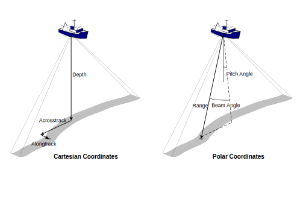
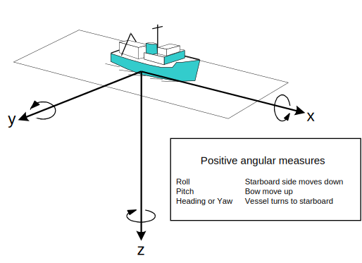
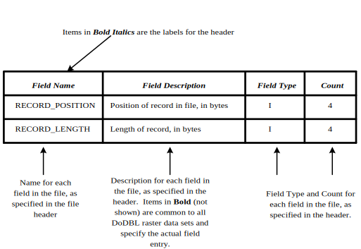
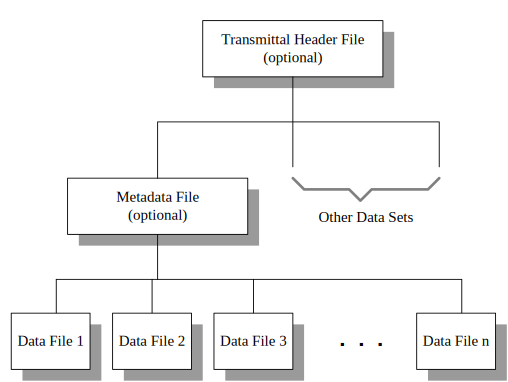
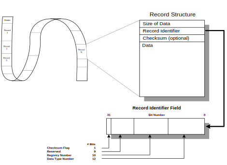
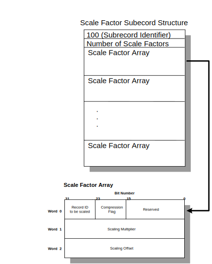

# GENERIC SENSOR FORMAT SPECIFICATION

    30 June 2014
    Generic Sensor Format Specification, version 03.06
    Leidos doc 98-16v

Prepared For:

    Naval Oceanographic Office
    Stennis Space Center, MS  39522

Prepared By:

    Leidos Corporation
    221 Third Street
    Newport, RI  02840

---------------------------------------

## Table of Contents

    1. INTRODUCTION ........................................................ 14
    1.1 Purpose   .......................................................... 14
    1.2 Background ......................................................... 14
    1.3 DoDBL overview ..................................................... 15
    1.3.1 Usage of GSF outside of DoDBL .................................... 15
    1.4 Goals .............................................................. 15
    1.4.1 Portability ...................................................... 16
    1.4.2 Extensibility .................................................... 16
    1.4.3 Efficiency ....................................................... 16
    1.4.4 Acceptance ....................................................... 17
    1.4.5 Consistency ...................................................... 17
    2. APPLICABLE DOCUMENTS ................................................ 18
    2.1Government documents ................................................ 18
    2.1.1 Specifications, standards, and handbooks ......................... 18
    2.1.2 Other Government documents, drawings, and publications ........... 18
    2.2 Non-Government publications ........................................ 19
    2.3 Order of precedence ................................................ 20
    3. CONVENTIONS ......................................................... 21
    3.1 Accuracy  .......................................................... 21
    3.2 Datums   ........................................................... 21
    3.3 Swath-related nomenclature ......................................... 21
    3.4 Ship-based coordinate system ....................................... 22
    3.5 Units of measure ................................................... 23
    3.6 Data element formats ............................................... 23
    3.6.1 Text ............................................................. 23
    3.6.2 Binary integers .................................................. 23
    3.6.3 Geographic coordinates ........................................... 24
    3.6.3.1 Text form ...................................................... 24
    3.6.3.2 Binary form .................................................... 24
    3.6.4 Depths ........................................................... 24
    3.6.5 Dates ............................................................ 25
    3.6.6 Times ............................................................ 25
    3.6.7 Angular measures ................................................. 25
    3.6.7.1 Heading and course ............................................. 25
    3.6.7.2 Yaw ............................................................ 26
    3.6.7.3 Roll ........................................................... 26
    3.6.7.4 Pitch .......................................................... 26
    3.7 Record Description ................................................. 26
    4. DATA STRUCTURE ...................................................... 28
    4.1 Transmittal Header File ............................................ 29
    4.2 Metadata File ...................................................... 30
    4.3 GSF Data File ...................................................... 30
    4.3.1 GSF Record Structure ............................................. 31
    4.3.1.1 Checksum flag .................................................. 31
    4.3.1.2 Record identification field .................................... 31
    4.3.1.2.1 Registry ..................................................... 32
    4.3.1.2.2 Data type .................................................... 32
    4.3.1.3 Checksum ....................................................... 32
    4.3.1.4 Data record .................................................... 32
    4.3.2 GSF Record Types ................................................. 32
    4.3.3 Header Record .................................................... 33
    4.3.4 Swath Bathymetry Ping Record ..................................... 34
    4.3.4.1 Ping header .................................................... 34
    4.3.4.2 Scale-factor subrecord ......................................... 36
    4.3.4.3 Array subrecords ............................................... 44
    4.3.4.4 Depth Array Subrecord .......................................... 45
    4.3.4.5 Nominal Depth Array Subrecord .................................. 45
    4.3.4.6 Acrosstrack Array Subrecord .................................... 45
    4.3.4.7 Alongtrack Array Subrecord ..................................... 45
    4.3.4.8 Travel-time Array Subrecord .................................... 45
    4.3.4.9 Beam-angle Array Subrecord ..................................... 46
    4.3.4.10 Mean Calibrated Amplitude Array Subrecord ..................... 46
    4.3.4.11 Mean Relative Amplitude Array Subrecord ....................... 46
    4.3.4.12 Echo Width Array Subrecord .................................... 46
    4.3.4.13 Quality factor Array Subrecord ................................ 46
    4.3.4.14 Receive Heave Array Subrecord ................................. 47
    4.3.4.15 Beam Flags Array Subrecord .................................... 47
    4.3.4.16 Quality Flags Array Subrecord ................................. 47
    4.3.4.17 Signal to Noise Array Subrecord ............................... 47
    4.3.4.18 Beam Angle Forward Array Subrecord ............................ 48
    4.3.4.19 Vertical Error Array Subrecord ................................ 48
    4.3.4.20 Horizontal Error Array Subrecord .............................. 48
    4.3.4.21 Sector Number Array Subrecord ................................. 48
    4.3.4.22 Detection Info Array Subrecord ................................ 48
    4.3.4.23 Incident Beam Adjustment Array Subrecord ...................... 48
    4.3.4.24 System Cleaning Array Subrecord ............................... 49
    4.3.4.25 Doppler Correction Array Subrecord ............................ 49
    4.3.4.26 Sonar Vertical Uncertainty Array Subrecord .................... 49
    4.3.4.27 Sensor-specific Subrecords .................................... 49
    4.3.4.28 Bathymetric Receive Beam Time Series Intensity Subrecord ...... 50
    4.3.5 Single-beam Sounding Record ...................................... 50
    4.3.6 Summary Record ................................................... 51
    4.3.7 Sound Velocity Profile Record .................................... 52
    4.3.8 Processing Parameter record ...................................... 53
    4.3.9 Sensor Parameter record .......................................... 72
    4.3.10 Comment record .................................................. 73
    4.3.11 History record .................................................. 73
    4.3.12 Navigation error record        *obsolete, as of GSF v1.07* ...... 74
    4.3.13 HV Navigation error record ...................................... 75
    4.3.14 Attitude record ................................................. 76

    Appendix A.1  Record Identifiers
    Appendix A.2  Swath Bathymetric Ping Subrecord Identifiers
    Appendix A.3  Single-beam Sounding Sensor Specific Records
    Appendix B.1  Swath Bathymetric Ping Sensor Specific Records
    Appendix B.2  Single-beam Sounding Sensor Specific Records
    Appendix B.3  Bathymetric Receive Beam Imagery Sensor Specific Subrecords
    Appendix C.1  Standard Ping Flag Definitions
    Appendix C.2  Standard Beam Flag Definitions

## TABLES

    Table 4-1 Transmittal Header File ..................................... 2
    Table 4-2 Header Record Definition .................................... 6
    Table 4-3 Swath Bathymetry Ping Record Definition ..................... 10
    Table 4-4 Single-beam Sounding Record Definition ...................... 54
    Table 4-5 Summary Record Definition ................................... 56
    Table 4-6 Sound Velocity Profile Record Definition .................... 56
    Table 4-7 Processing Parameter Record Definition ...................... 57
    Table 4-8 Defined Processing Parameter Text Strings ................... 58
    Table 4-9 Sensor Parameter Record Definition .......................... 75
    Table 4-10 Comment Record Definition .................................. 76
    Table 4-11 History Record Definition .................................. 77
    Table 4-12 Navigation Error Record Definition ......................... 78
    Table 4-13 HV Navigation Error Record Definition ...................... 78
    table C-14. example ping flag, observed, verified tides applied ....... 2
    table C-15. Beam flagged as ignore - uncertainty criteria is exceeded . 5

## FIGURES

    Figure 3-1 Coordinate systems for beam location ....................... 2
    Figure 3-2 Ship-based coordinate system ............................... 3
    Figure 3-3 GSF definition conventions ................................. 7
    Figure 4-1 Data Set Organization ...................................... 1
    Figure 4-2 GSF Data File Structure .................................... 4
    Figure 4-3 Ping record schematic ...................................... 8
    Figure 4-4 Ping Scale Factor Subrecord Schematic ...................... 48

# 1. INTRODUCTION

## 1.1 Purpose

This report documents a Generic Sensor Format (GSF) for use as an exchange format in the
Department of Defense Bathymetric Library (DoDBL), one of three DoDBL processing
formats.  Similar formats are under development for the interchange of vector data, such as
hydrographic soundings and features; and raster data, such as gridded bathymetry and
processed acoustic imagery.

This standard focuses on the encoding of multibeam data, the highest priority for the
DoDBL; single-beam data is included as well.  It is also designed to be expandable to encode
unprocessed acoustic imagery as those Defense Hydrographic Initiative (DHI) requirements
become clearer.  It is intended for coordination among the DoDBL nodes - the Defense
Mapping Agency (DMA), the Naval Oceanographic Office (NAVOCEANO), the National Ocean
Service (NOS), and the National Geophysical Data Center (NGDC), as well as academia and
industry to collect data and design systems that use GSF.

## 1.2 Background

GSF is designed to efficiently store and exchange information produced by geophysical
measurement systems before it has been processed into either vector or raster form.  A
sensor data set contains all the information needed to compute the depth or other values at
a specific geographic position, but that calculation has not yet been made.  This structure is
particularly useful for data sets created by systems such as multibeam echosounders that
collect a large quantity of data from a single location and initially express geographic
positions in relative terms.  GSF not only saves storage space and reduces data transfer
volumes, it also provides the receiver with critical information that may be lost when
processing the oversampled data to either raster or vector form.

The current use of GSF is to define data from bathymetric and imagery surveying systems;
however, this is only one of a class of sensors that GSF can support.  Acoustic imagery,
seismic reflection profiles, swept-frequency (chirp) sub-bottom imagery are other classes of
data that may be incorporated into the DoDBL but cannot be efficiently stored in either
vector or raster form.

This draft standard implementation was based on earlier work at the University of Rhode
Island supported by DHI and other work at the Naval Research Laboratory (NRL).  This paper
does not present the rationale for this implementation.  The rationale is based on two
earlier papers, which describe the overall rationale and approach (Ferguson and Chayes,
1992 and 1995) and on extensive discussions with Mssrs. deMoustier and Charters at
Scripps Institute of Oceanography.

## 1.3 DoDBL overview

The DoDBL is a distributed library of bathymetric and hydrographic data (note: the
Hydrographic Source Assessment System (HYSAS) documentation uses these terms
interchangeably).  The data, which are acquired and archived by organizations in the
Department of Defense (DoD) and the Department of Commerce National Oceanic and
Atmospheric Administration (NOAA), may be stored in many different structures and
formats.  The intent of this specification is to ease data exchange among the nodes by
standardizing the format for sensor data files, including unprocessed bathymetry and
acoustic imagery.  The two other general types of data in the DoDBL: vector (which includes
single-beam soundings) and raster (which includes gridded bathymetry and rectified
acoustic imagery) use similar specifications.  GSF is also intended for data transfer between
collection platforms and their respective DoDBL node.

There are many sources for DoDBL data sets.  The GSF deals primarily with multibeam
(swath) and acoustic imagery data sets that are collected by both DoD and non-DoD survey
vehicles.

### 1.3.1 Usage of GSF outside of DoDBL

This specification describes the form of data being exchanged within the DoDBL.  The format
described in this specification is intended, however, to be of use outside the DoDBL.  Using
this format will increase the efficiency of data transfer between the agency's internal
archive and the DoDBL and, perhaps, between agencies without direct access to the DoDBL.
For use of this specification outside the DoDBL, Transmittal files and Metadata files are
optional, although their use is encouraged.  Many of the elements of the Metadata file may
be most accurately described immediately after the data have been collected.  From the
moment the data are collected, adoption of the Metadata file as a method of maintaining
important descriptive information can significantly enhance the data's long-term usability.

## 1.4 Goals

GSF is designed to be modular and adaptable to meet the unique requirements of a variety
of sensors.  The goals of the Generic Sensor Format are:

- Portability among all major computing platforms.
- Extensibility so that new types of data and measurements can be easily incorporated.
- Efficiency in terms of storage volume and data access.
- Endorsement by the major groups of users outside the DoDBL.
- Consistency with other DoDBL formats.

### 1.4.1     Portability

Portability among the various computing platforms that will collect, process, and store data
in GSF is critical.  Adequate data description and the exclusive use of industry, national and
international standards for data encoding ensure portability in this standard.  Where
practical, GSF is consistent with industry standards for network exchange.  This will reduce
the time for some systems once the DoDBL nodes are fully networked.

### 1.4.2 Extensibility

Because of the rapid state of development in sensor systems, it is very important to provide
a mechanism for planned growth and evolution.  Increasing sophistication of the sensor
systems and signal processing techniques have increased the information extracted from a
single ping.  It is essential that GSF allow for expansion to prevent early obsolescence of the
format.  GSF achieves extensibility through modular structure and self-description.

New data elements can be specified for new data records and these records can be
introduced into a data stream without forcing all programs that may read them to be
modified.  These features taken together allow different network implementations to
coexist on the same data path and are partly responsible for the popularity and success of
the Ethernet transport protocol.  By adopting a similar approach, GSF has been equipped
with a mechanism for gradual change that should help ensure its long-term usefulness.

### 1.4.3 Efficiency

To enhance storage efficiency, GSF makes extensive use of binary encoding.  Most data
elements within GSF are numeric, and it is estimated that the use of standard binary 2- and
4-byte big endian (most significant byte first) integers reduces storage volume by 40-50%.
The self-defining header schema and time-tagged records allow efficient data access.

### 1.4.4 Acceptance

The development of this specification incorporated inputs from many different segments of
the swath mapping community.  Representatives of commercial, academic and federal
agencies all provided valuable feedback during the definition of this specification.

### 1.4.5 Consistency

This standard is consistent with the other standards to be used in the DoDBL.  It has a
common Transmittal Header File to allow rapid identification by the receiver, and common
Metadata elements to provide the standard DHI ancillary information about the data set.  It
also uses big endian binary like the proposed Raster Data Exchange Standard (RDES) to
obviate the need to develop unique utilities.

# 2. APPLICABLE DOCUMENTS

## 2.1 Government documents

### 2.1.1 Specifications, standards, and handbooks

The following specifications, standards, and handbooks form a part of this document to the
extent listed below.  Unless otherwise specified, the issues of these documents are those
listed in the current Department of Defense Index of Specifications and Standards (DODISS)
and the supplement thereto.

MILITARY STANDARDS

- MIL-STD-490A Specification Practices
- MIL-STD-600001 Mapping Charting & Geodesy Accuracy Standard, 26 February 1990
- MIL-STD-600003 MC&G Product Generation Rules

(Unless otherwise indicated, copies of federal and military specifications, standards, and
handbooks are available from the Standardization Documents Order Desk, Bldg. 4D, 700
Robbins Avenue, Philadelphia, PA 19111-5094.)

#### 2.1.2 Other Government documents, drawings, and publications

The following Government documents, drawings, and publications form a part of this
document to the extent specified.  Unless otherwise listed, the document versions are those
cited in the solicitation.

- DMA TM 8358.1 Datums, Ellipsoids, Grids, and Grid Reference Systems.  First Edition.  September 1990
- DIAM 65-18 Defense Intelligence Agency Manual - Geopolitical Data Elements and Related Features.  March 1984

(These publications are available from DMA by writing to: Director, Defense Mapping
Agency, ATTN: PR, 8613 Lee Highway, Fairfax, VA  22031-2137.)

## 2.2   Non-Government publications

The following publications form a part of this document to the extent specified.  Unless
otherwise noted, the issues of the documents that are DoD adopted are those listed in the
issue of the DODISS cited in the solicitation.  The issues of documents not listed in the
DODISS are the issues of the documents cited in the solicitation.

- ANSI/IEEE 754-1985.  IEEE Standard for Binary Floating Point Arithmetic.  August 12, 1985.
  (Application for copies should be addressed to the publisher: IEEE, Inc., 345
  East 47th St., NY,  10017)
- ANSI/IEEE Std 1003.1b-1993.    IEEE Standard for Information Technology - Portable
  Operating System Interface (POSIX) - Part 1: System Application Program
  Interface (API) - Amendment 1: Realtime Extension [C Language].
  (Application for copies should be addressed to the publisher: IEEE, Inc., 345
  East 47th St., NY, 10017)
- ANSI x3.4-1977.  Code for Information Interchange (ASCII) Adopted in FIPSPUB 1-1, 24
  December 1980.
- ISO 8601.  International Organization for Standardization, Data Elements and Interchange
  Formats - Information Interchange - Representation of Dates and Times,
  1988   (Application for copies should be addressed to the American National
  Standards Institute, 1430 Broadway, New York, NY  10018).
- Bureau of the Budget, United States National Map Accuracy Standards, Government Printing
  Office, 1947.  (This standard is printed in its entirety in Thompson, Morris
  M., 1988, Maps for America, U.S. Geological Survey, 3rd ed., p. 104).
-  Chayes, D.A., Nishimura, C.E., Czarneki, M.F., Pitcher, D. 1991. A Paradigm for Processing
  Sidescan and Bathymetry: The Next Generation. Proceedings of the
  Maritime Technical Society.
- Ferguson, J.S. and Chayes, D.A. 1992.  A Generic Swath-Mapping Data Format. Marine
  Geodesy vol. 15, pp 129-140
- Ferguson, J.S. and Chayes, D.A. 1995.  Use of a Generic Sensor Format to Store Multibeam
  Data.  Marine Geodesy vol. 18, pp 299-315
- GSFlib, the Generic Sensor Format Library, 16 January 2001.

Non-government standards and other publications are normally available from the
organizations that prepare or distribute the documents.  These documents also may be
available in or through libraries or other information services.

## 2.3 Order of precedence

If there is a conflict between the text of this document and the references cited herein
(except for related associated detail specifications, specification sheets, or MS standards),
the text of this document takes precedence.  Nothing in this document, however,
supersedes applicable laws and regulations unless a specific exemption has been obtained.

# 3. CONVENTIONS

## 3.1 Accuracy

Data files exchanged using the GSF may be of any accuracy.  However, the horizontal and
vertical accuracy must be determined by standard method and cited in the Metadata File or
supporting documentation.

## 3.2 Datums

The preferred horizontal datum is the World Geodetic System 1984 (WGS-84) ellipsoid.
However, data files exchanged using the GSF may be referenced to any datum as long as the
datum is cited in the Metadata File or supporting documentation

The preferred vertical (sounding) datum is the WGS-84 geoid.  However, data files
exchanged using the GSF may be referenced to any datum as long as the datum is cited in
the Metadata File or supporting documentation.  All depths shall be referenced as positive
displacements below datum; e.g., a depth of 100 meters below datum would be
represented as 100.

## 3.3 Swath-related nomenclature

Two methods of determining beam location relative to a vessel are allowed by GSF, as
illustrated by Figure 3-1.  Most multibeam sonars provide data in a mixture of both systems.
The first is a polar coordinate system with the vessel at the center of a sphere.  Individual
soundings are located by measuring the range from the vessel to the bottom and the beam
angle.  The pitch angle is also required and is usually constant for a given ping.

**Figure 3-1** Coordinate systems for beam location.

GSF also supports a Cartesian system in which individual soundings are located by describing
their depth, acrosstrack and alongtrack offsets.  Alongtrack offsets may be expressed for
each ping or each beam, as appropriate to the specific system, and may be encoded as a
distance or a pitch angle.

## 3.4   Ship-based coordinate system

Figure 3-2 shows the ship-based coordinate system used to refer to both onboard locations
of sensors and their ship-based measurements.  The vessel's direction of travel is along the
x-axis.  The z-axis is positive down to be consistent with the convention that depths are
expressed as positive numbers.  The y-axis is defined to point to starboard in order to form a
right-handed coordinate system and is consistent with the usual convention that beam
offsets increase in the positive direction.  The origin of the coordinate system is arbitrarily
located on the vessel, either at the center of the sonar's transducer array or at the vessel's
center of motion, as appropriate.

Depths are positive and increase as one moves below the ocean's surface, acrosstrack
offsets are positive to the vessel's starboard and negative to port, and alongtrack offsets are
positive forward of the vessel's reference position and negative astern of it.  Heave is
positive if the vessel moves below the mean or reference surface.

**Figure 3-2** Ship-based coordinate system.

## 3.5 Units of measure

Units of measurement in this specification are metric and are the preferred units of
measurement for GSF files.  However, data from systems that use English units may be
recorded as such, so long as these units are properly documented.

## 3.6 Data element formats

### 3.6.1 Text

Text shall be standard ASCII characters as defined by ANSI x3.4-1977.  Text fields shall
normally be fixed-length, but Comments fields are variable-length.  Text fields are left
justified and are signified in this specification by a "T".

### 3.6.2 Binary integers

To reduce storage volume, GSF makes extensive use of binary integers.  All integers shall be
big endian (most significant byte first), and may be either 1-byte unsigned, 2-byte signed or
unsigned, or 4-byte signed, as required and as specified in the file header.  An "I" shall
identify signed binary integers in this specification; a "U" shall identify unsigned integers.

GSF may make use of binary integer arrays.  When specifying the length of the array, the
format is <integer length>*<number of integers>.  For example, a field type of "I" and a
count of "2*3" indicate a 2-byte integer array with three elements.  GSF often encodes
several integers within one 32-bit word.  The structure of these packed words is fully
defined in this specification.

### 3.6.3 Geographic coordinates

Horizontal position coordinates may be encoded either as a special case of the text field or
binary integer field.

#### 3.6.3.1 Text form

Position in text form shall normally be used in high-level GSF files such as the Metadata file
and shall be specified in the format:

±DDDMMmmmm±DDMMmmmm,

where D=degrees, M=minutes and m=.0001 minutes, the first set of
values specifies the longitude (+ is East), and the second set of values specifies the latitude
(+ is North)

#### 3.6.3.2 Binary form

For example, -075300000+45160020 would be 45°16.002'N 75°30'W.

To maintain consistency with the rest of the file and reduce storage volume, the GSF data
files use position in binary form.  Latitude and longitude are encoded using two 4-byte
signed integer fields representing ten-millionths of degrees.  Latitude is positive in the
Northern Hemisphere and longitude is positive in the Eastern Hemisphere.

For example,   latitude = 325000000          longitude = -0702550000,
would be 32.5°N (32°30'N)          70.255°W (70°15'18"W).

### 3.6.4 Depths

Normally, depth measurements shall be in meters or decimeters.  Some multibeam systems
consistently calculate depths according to the English measurement system, recording them
in fathoms.  These units are acceptable if properly documented.  In all cases, it is imperative
to explicitly state the assumptions used to derive these values.  For example, depths
reported in meters may assume a constant sound velocity of 1500 meters/second to derive
the depths.  This fact must be properly recorded in the SOUND_VELOCITY field of the
metadata file.

### 3.6.5 Dates

Date fields shall conform to ISO 8601, paragraph 5.2.1.1 (Basic Format), and shall be of the
form CCYYMMDD (e.g., 19920831 for August 31, 1992).  A "D" shall identify date fields in
this specification.  Such fields are usually limited to transmittal and metadata files.

### 3.6.6 Times

The representation of time within the GSF is an important design element.  Because time
appears in many places within a GSF data set, it can have a significant impact on data
volume.  In transmittal and metadata files, ISO 8601 defines standards for representation of
dates.  In the data files, ISO 8601 is not appropriate because the standard only allows
character representations.  It would expand data volume by an unacceptable amount.
The POSIX System Application Program Interface standard controls representation of Time
in GSF data files.  This includes real-time extensions and uses a combination of three values:
a reference time, the number of seconds that have elapsed since the reference point, and
the number of nanoseconds that have elapsed since the beginning of the current second.
The reference time is specified as midnight on 01 January 1970 Universal Time Coordinated
(UTC).  Data collected prior to 1970 may be handled with a reference time earlier then 01
January, 1970.  A 4-byte integer field specifies the number of elapsed seconds since the
reference time.  A second 4-byte integer field specifies the number of elapsed nanoseconds
since the beginning of the current second.  All time values in GSF are required to be relative
to UTC.

### 3.6.7 Angular measures

Angular measures such as heading, course, yaw, roll and pitch are represented in
hundredths of degrees and are stored as 2-byte signed or unsigned integers.

#### 3.6.7.1 Heading and course

Heading refers to the direction of the vessel's bow and course refers to the direction of its
motion through the water.  Heading and course are measured from true North, and describe
the vessel's rotation about the z-axis.  They increase in value as the vessel turns to starboard
in accordance with standard compass angular measures and have a range of 0.00 to 360.00
using a 2-byte unsigned integer.

#### 3.6.7.2 Yaw

The vessel's short-term rotation about the z-axis is the Yaw.  It is measured from the bow of
the ship and increases toward the starboard side of the vessel.  Yaw normally describes
short-term oscillation or pointing errors due to gyrocompass or transducer array
misalignment.  Yaw has a valid range of -180.00 to +180.00 using a 2-byte signed integer.

#### 3.6.7.3 Roll

Roll describes the vessel's rotation about the x-axis.  Roll is measured from references
established when the vertical reference sensor system is calibrated and should be near zero
when the ship is evenly trimmed.  Roll increases in value as the ship's starboard side moves
downward and has a valid range of -180.00 to +180.00 using a 2-byte signed integer.

#### 3.6.7.4 Pitch

Pitch describes a ship's rotation about the y-axis.  Like roll, pitch is measured from
references established when the vertical reference sensor system is calibrated and should
be near zero when the ship is evenly trimmed. Pitch increases as the sensor platform moves
upward and has a valid range of -180.00 to +180.00 using a 2-byte signed integer.

## 3.7 Record Description

Each record is composed of a set of fields that contain the data elements that are defined in
subsequent tables.  Fields may be big-endian binary (most significant byte first) or ASCII and
may be fixed- or variable-length.  This specification presents GSF records in tabular form.
Figure 3-3 describes the conventions used in these tables.

**Figure 3-3** GSF definition conventions.

# 4. DATA STRUCTURE

Data stored in Generic Sensor form are contained in several files, each with a specific use.  A
complete GSF data set contains all these files, related as shown in Figure 4-4.  These files
are:

- Transmittal files that describe what data are being transmitted in a given transaction
  and how they may be handled,
- Metadata Files that describe the contents and nature of a given collection of data, and
- Files containing the data themselves.

**Figure 4-4** Data Set Organization

Transmittal files are developed to describe a particular transaction.  Transmittal files are not
a permanent record that describes the data, but record the transfer of data, document the
prescribed handling, the format of the media and the specifications that describe the data's
form.

Metadata files describe the data themselves, including their temporal and areal extent, and
the overall condition of a GSF data set.

GSF data files are organized by time; data collected over a given time period shall be stored
in a single file.  All the data collected from a given sensor over a period of time is recorded in
a single file.  The amount of data recorded in a given sequential file may be fixed (e.g., data
may be segregated by date of collection) or may be based on operational requirements such
as survey layout.  A GSF data set may be composed of one or more GSF data files.  Data sets
will generally be segregated based on operational or logistical factors such as survey area or
cruise duration.  A single metadata file describes the contents of the entire data set.

# 4.1 Transmittal Header File

This file, common to all DoDBL exchange sets, provides information on the type of data to
be exchanged, the number of data sets in the exchange, the highest security classification,
and the standards and specifications used for this transmittal.  It can be printed and
provided in hardcopy when the transmittal is by physical (not network) exchange.  If the
transmittal spans more than one volume, then each volume shall have a Transmittal Header
File.  The use of the Transmittal Header File is mandatory for exchanges within the DoDBL
but is optional for data exchanged outside of the DoDBL.  Table 4-1 specifies the contents of
the Transmittal Header File.

**Table 4-1** Transmittal Header File.

Field Name | Field Description | Field Type | Count
-----------|-------------------|------------|------
VERSION | Version Number (reserved) | T | 10
DATA_NAME | DoDBL Sensor | T | 12
DATA_DESCRIPTION | General description of data | T | 100
MEDIA_STD | Media standard used on this volume. E.g., ISO 9660 | T | 20
ORIGINATOR | Sender, e.g., DMAHTC | T | 50
ADDRESSEE | Receiver with address | T | 120
MEDIA_VOLUMES | Number of volumes in this transmittal | T | 2
SEQ_NUMBER | Sequential order of this volume | T | 2
NUM_DATA_SETS | Number of data sets in this transmittal | T | 2
SECURITY_CLASS | Highest classification on this volume (See HRD) | T | 1
DOWNGRADING | Originating Activity Determination Required (OADR)? YES or NO | T | 3
DOWNGRADE_DATE | Date of downgrading, blank if OADR | D | 1
RELEASABILITY | Releasability restrictions | T | 20
OTHER_STD_NAME | Generic Sensor Format | T | 50
OTHER_STD_DATE | Publication date of GSF | D | 1
OTHER_STD_VER | Version of GSF | T | 10
TRANSMITTAL_ID | Unique ID for this transmittal | T | 12
EDITION_NUMBER | Edition number for this database | T | 10
EDITION_DATE | Date of creation for this database | D | 1

## 4.2 Metadata File

This file, also contained within all DoDBL exchange sets, provides information on the
computed quality, the parameters used to compute quality, the areal extent, and the
security classification of each individual data set.  There is one Metadata File for each data
set in the transmittal.  It is permissible to forward a hardcopy listing of the information
contained in the Metadata File as long as the information is complete and accurate.  The use
of the Metadata File is mandatory for exchanges within the DoDBL; it is optional for
exchanges that do not occur within the DoDBL mechanism.  Its use is strongly encouraged,
however, to assure uniform maintenance of important descriptive data.  The HYSAS
Requirements Document (HRD) specifies the contents of the Metadata File.

## 4.3 GSF Data File

GSF data files are composed of a series of records arranged sequentially in time.  A header
record is the first record in the file; otherwise, there is no prescribed ordering.  Note,
however, that specific processing implementations may require the presence of other
records in order to function, especially summary and processing parameter records.

## 4.3.1 GSF Record Structure

The first word of each record contains one 32-bit unsigned integer that defines the size of
the data portion of the record.  The second word is an identifier field consisting of a
checksum flag, a reserved field and a record identification field.  Figure 4-5 illustrates this
structure.

**Figure 4-5** GSF Data File Structure.

#### 4.3.1.1 Checksum flag

The checksum flag is the first bit in the word; when set to one, a checksum immediately
follows the record identifier.

#### 4.3.1.2 Record identification field

The record identifier contains a number that can be related uniquely to the structure
defining the data field.  It is divided into registry and data type subfields to allow a
distributed method of assigning these fields.

##### 4.3.1.2.1 Registry

The registry portion of the record identifier is a ten-bit unsigned integer identifying the
registrar responsible for assigning data type subfield numbers.  It allows more than one
group to be responsible for the assignment process by assigning registry numbers to each
group.  Those records, defined in Appendix A.1 of this document, have a registry number of
zero.  Other registry numbers are assigned to individual agencies, institutions or
corporations, allowing them to define "private" data type identifiers that will not conflict
with the standard ones.  The group's registry number is a prefix for these private data
records.  Other groups need not know what types of data are contained within a private
data record; they may simply ignore the record and skip to the next one.  If some privately
defined data types become commonly used, then reassigning them a new number with a
registry number of zero and defining the data type within the standard incorporates them
into the standard.

##### 4.3.1.2.2 Data type

The data type portion of the record identifier field is a 12-bit unsigned integer that defines a
specific data structure.  The registrar identified in the registry portion is responsible for
assigning data type numbers.

#### 4.3.1.3 Checksum

If the checksum flag has been set, a record checksum is contained in the 32-bit word that
follows the identifier field, otherwise this word is absent.  If present, this word contains an
integer number that is the sum of all the bytes between the checksum and the end of the
record in modulo-32 form.  Specifying the checksum allows GSF data to be reliably
transmitted across a noisy communication path.  Normally, checksums would not be used
for data stored on disk.

#### 4.3.1.4 Data record

A data structure that has been related to the data identifier by the appropriate registrar
identifies the data record.  The only restriction on a data record is that it must be an integral
multiple of four bytes long; therefore, between zero and three empty bytes may be
appended to the end of a data record.

### 4.3.2 GSF Record Types

As should be clear from the previous section, there are no restrictions on the type of data
that can be encapsulated into Generic Sensor Format.  At present, however, only
bathymetry and imagery data are stored in this format.  The format supports both single-
beam and multibeam bathymetry data.  The records currently defined include:

- a header record,
- a swath bathymetry ping record to contain multibeam bathymetry data,
- a single-beam sounding record to contain single-beam data,
- a summary record to record the temporal and spatial extremes of the data
- a sound velocity profile record,
- a navigation error record to allow the positional error estimate associated with a given
  data point to be described,
- an attitude record to record full time series attitude data
- a processing parameter record to define the state of the data recorded in the file,
- a sensor parameter record to record the state of the sensor when the data were
  produced,
- a comment record for annotating the data, and
- history records that provide an audit trail of processing that has been applied to the
data.

Not all record types must be present to describe the data; for instance, a file may only
consist of ping records if only those data are available or desirable.  All records contain a
time field consisting of precise time and will normally, but not necessarily, be in
chronological order.  The format of each GSF data record is defined in the following sections.

## 4.3.3 Header Record

The header record contains a single text field recording the version number of the GSF data
file format as described in Table 4-2.

**Table 4-2** Header Record Definition.

Field Name | Description | Field Type | Count
-----------|-------------|------------|------
VERSION    | Version of GSF | T       | 12

Header Record Size: 12

### 4.3.4 Swath Bathymetry Ping Record

A ping record consists of a mandatory ping header and one or more optional subrecords.
Figure 4-6 shows the swath bathymetric ping record in schematic form.  The normal
configuration for a ping record consists of a ping header, a pair of array subrecords
containing depth and acrosstrack values and other optional subrecords that may not appear
in every ping.  Table 4-3 defines the record’s data elements including the ping header and all
subrecords.  Appendix A.2 defines swath bathymetric ping record identifiers.
In some cases, a subrecord may contain a set of values that applies to a series of pings.  This
subrecord is placed in the first record to which it applies.  These values will then be
considered to apply until a new instance of the subrecord appears.  Subrecords which may
be used in this manner include scale factor subrecords and the error array subrecords
containing estimates of measurement errors, including the HORIZONTAL_ERROR_ARRAY,
and VERTICAL_ERROR_ARRAY.

#### 4.3.4.1 Ping header

A ping header consists of time, vessel's position, attitude, heading, course and speed, all of
which are stored in standard form.  The header also contains the number of beams in the
ping's array records (defined as N for array subrecord definitions), the index, or column,
number of the beam located nearest the vessel's keel, a ping flag, and both tide and depth
offsets for the ping.  Any tide and depth offsets present have already been added to the
depth values in the ping's array records.

**Figure 4-6**  Ping record schematic

Two sets of flags are available in the ping record to provide for data to be flagged to indicate
whether it is usable or not.  Each ping header has a ping flag that is a 16-bit word that
defines the usability of the ping's data.  If the low-order bit (bit 0) of the ping flag is clear,
the ping can be used for processing or display.  If this bit is set, the ping data can not be
used.  The remaining fifteen bits are not defined within this specification; they allow users to
define implementation-specific reasons for flagging the ping.  Each ping may also contain a
"BEAM_FLAGS_ARRAY" that indicates whether individual beams are usable.  Section
4.3.4.15 further describes beam flags.

#### 4.3.4.2 Scale-factor subrecord

Scale factors change the range and resolution of the values in array subrecords.  This allows
all ocean depths to be expressed in meters with sufficient resolution, and acoustical
measurements to be expressed in decibels with sufficient resolution.  After applying the
scale factors, all of the beam array values are encoded in external form as signed or
unsigned integers.  Some beam array values allow the user to define the field size to support
saving the data at a fixed precision. The depth, nominal depth, along track, across track, and
travel time arrays can be saved as either two-byte or four-byte integer values as specified by
the user. The field size value should be specified once and then enforced for all records
within a file.  The beam amplitude values and beam echo width values can be saved as
either one-byte or two-byte quantities.  The beam array scale factor values are saved in the
scale factors sub-record of the ping record. This subrecord exists for the first ping of every
file, and then again whenever the scale factors change. As a disk-space saving mechanism,
this subrecord is not written for every ping record.

**Table 4-3** Swath Bathymetry Ping Record Definition.

Ping Header Subrecord: 42 in versions prior to 3.01; 56 otherwise

Field Name | Description | Field Type | Count
-----------|-------------|------------|------
TIME | Time of ping transmission | I | 2*4
LONGITUDE | Longitude of reference point in ten-millionths of degrees. Positive values are east longitude. | I | 4
LATITUDE | Latitude of reference point in ten-millionths of degrees. Positive values are north latitude. | I | 4
NUM_BEAMS | Number of beams in ping (N) | I | 2
CENTER_BEAM | Location of center beam.  The first beam is the outermost port beam. | I | 2 
PING_FLAGS | Flags that indicate the usability of the ping data.  See section 4.3.4.1 | I | 2
RESERVED | Reserved for future use | I | 2
TIDE_CORRECTOR | Water level correction in centimeters.  This value (or the GPS tide corrector) has been added to all depth values in the ping whether they are flagged as usable or not. The ping flag field provides an indication of whether vertical control results from water level measurement or GPS heights. | I | 2
DEPTH_CORRECTOR | Dynamic draft (or vessel depth for submersible vessels) in centimeters.  This value has been added to all depth values in the ping. | I | 4
HEADING | Ship's heading in hundredths of degrees including any offsets that have been applied to the data as documented in the processing parameter record | U | 2
PITCH | Ship's pitch in hundredths of degrees including any offsets that have been applied to the data as documented in the processing parameter record | I | 2
ROLL | Ship's roll in hundredths of degrees including any offsets that have been applied to the data as documented in the processing parameter record | I | 2
HEAVE | Ship's heave in centimeters | I | 2
COURSE | Ship's direction of motion through water in hundredths of degrees | U | 2
SPEED | Ship's speed in hundredths of knots | U | 2
HEIGHT | Height of reference point above the ellipsoid (in GSF version 03.01 and higher). Positive height is above ellipsoid. Field precision is 0.001 meters. Field will be undefined following gsfRead of file created with GSF library version 1.x or 2.x. | I | 4
SEPARATION | Ellipsoid to chart datum separation. (in GSF version 03.01 and higher). Positive value indicates vertical datum is above ellipsoid. Field precision is 0.001 meters. Field will be undefined following gsfRead of file created with GSF library version 1.x or 2.x. | I | 4
GPS_TIDE_CORRECTOR | GPS based vertical control corrector in millimeters. (In GSF version 03.01 and higher) This value (or the tide corrector) has been added to all depth values in the ping whether they are flagged as usable or not. The ping flag field provides an indication of whether vertical control results from water level measurement or GPS heights. Field will be undefined following gsfRead of file created with GSF library version 1.x or 2.x. | I | 4
SPARE | Reserved for future use; in GSF version 03.01 and higher only. | I | 2

Scale Factor Subrecord 4 + 12M

Field Name | Description | Field Type | Count
-----------|-------------|------------|------
NUM_FACTORS| Number of scale factors (M) | I | 4
SCALE_FACTOR_ARRAY | ID, compression flag, scale factor and offset values for each array subrecord in the ping, see section 4.3.4.2 | | 12*M

Beam Array Subrecords.

Some of the following arrays are used to record data from each beam.

Field Name | Description | Field Type | Count
-----------|-------------|------------|------
DEPTH_ARRAY | Depth (z) values for each beam in meters, corrected for measured sound velocity.  Scale factors applied before storage. | U | 2*N or 4*N
NOMINAL_DEPTH_ARRAY | Depth (z) values for each beam in meters, using an average sound speed of 1500 m/s.  Scale factors applied before storage. | U | 2*N or 4*N
ACROSS_TRACK_ARRAY | Acrosstrack (y) values in meters. Scale factors applied before storage. | I  | 2*N or 4*N
ALONG_TRACK_ARRAY | Alongtrack (x) values in meters. Scale factors applied before storage. | I | 2*N, or 4*N
TRAVEL_TIME_ARRAY | Travel time in seconds.  Scale factors applied before storage. | U | 2*N, or 4*N
BEAM_ANGLE_ARRAY | Incoming beam angle at transducer face in degrees.  Scale factors applied before storage. | I | 2*N
MEAN_CAL_AMPLITUDE_ARRAY | Mean amplitude in decibels (referenced to 1 micropascal at 1 meter).  Scale factors applied before storage. | I | 1*N, or 2*N
MEAN_REL_AMPLITUDE_ARRAY | Mean amplitude in decibels relative to an arbitrary intensity.  Scale factors applied before storage. | U | 1*N, or 2*N
ECHO_WIDTH_ARRAY | Measured width of bottom echo in seconds.  Scale factors applied before storage. | U | 1*N, or 2*N
QUALITY_FACTOR_ARRAY | Measures of beam quality in arbitrary units.  Meaning of each field is dependent on the sensor in use. | U | 1*N
RECEIVE_HEAVE_ARRAY | Ship's heave at receive time in meters.  Scale factors applied before storage. | I | 1*N
DEPTH_ERROR_ARRAY | Estimated depth measurement error in meters.  Scale factors applied before storage. (OBSOLETE: replaced with horizontal_error_array and vertical_error_array. New applications should use horizontal_error_array and vertical_error_array.) | U | 2*N 
ACROSS_TRACK_ERROR_ARRAY | Estimated across track measurement error in meters. Scale factors applied before storage. (OBSOLETE: replaced with horizontal_error_array and vertical_error_array. New applications should use horizontal_error_array and vertical_error_array.) | U | 2*N 
ALONG_TRACK_ERROR_ARRAY | Estimated along track measurement error in meters. Scale factors applied before storage. (OBSOLETE: replaced with horizontal_error_array and vertical_error_array. New applications should use horizontal_error_array and vertical_error_array.) | U | 2*N
BEAM_FLAGS_ARRAY | Flags that indicate whether individual beam data are usable. See section 4.3.4.15 | U | 1*N
QUALITY_FLAGS_ARRAY | Flags provided by Reson sonar systems describing bottom detection parameters and/or quality.  This value is packed as a two-bit quantity per beam. (OBSOLETE: New applications should use the quality_factor array subrecord.) | U | N/4
SIGNAL_TO_NOISE_ARRAY | Signal to noise ratio of each beam. | I | 1*N
BEAM_ANGLE_FORWARD_ARRAY | Beam angle in the fore-aft direction in degrees.  Scale factors applied before storage. | U | 2*N
VERTICAL_ERROR_ARRAY | Array of estimated vertical error (meters, at 95% confidence) | U | 2*N
HORIZONTAL_ERROR_ARRAY | Array of estimated horizontal error (meters, at 95% confidence) | U | 2*N
SECTOR_NUMBER_ARRAY | Array of values that specify the transit sector for this beam | U | 1*N
DETECTION_INFO_ARRAY | Array of values that specify the method of bottom detection | U | 1*N
INCIDENT_BEAM_ADJ_ARRAY | Array of values that specify incident beam angle adjustment from beam_angle | I | 1*N
SYSTEM_CLEANING_ARRAY | Array of values that specify data cleaning information from the sensor | U | 1*N
DOPPLER_CORR_ARRAY | Array of values used to correct the travel times for Doppler when transmission is FM | I | 1*N
SONAR_VERTICAL_UNCERTAINTY_ARRAY | Array of values from the sonar for the component of the total vertical uncertainty (TPU) corresponding to the measurement made by the sonar. | U | 2*N

Sensor Specific Subrecord.  See Appendix B.1 for definitions.

BRB_INTENSITY, Structure containing bathymetric receive beam time series
intensities, and associated per-ping information.

Field Name | Description | Field Type | Count
-----------|-------------|------------|------
BITS_PER_SAMPLE | Number of bits per intensity sample. | I | 1
APPLIED_CORRECTIONS | Flags to describe corrections applied to intensity values. | I | 4
SPARE | Reserved for future use. | I | 16
SENSOR_IMAGERY | Sensor specific imagery information. See Appendix B.3 for definitions. | |

TIME_SERIES_INTENSITY, Array of structures containing the per-beam time series intensity information. Size*N

Field Name | Description | Field Type | Count
-----------|-------------|------------|------
SAMPLE_COUNT | Number (Ns) of intensity samples for this beam. | I | 2
DETECT_SAMPLE | Index of bottom detection sample for this beam. | I | 2
SPARE | Reserved for future use. | I | 8
SAMPLES_ARRAY | Array of Ns intensity samples, in dB. | I | 4*Ns

Swath Bathymetry Ping Record Size:  variable

Figure 4-7 describes scale factor subrecords schematically.  After the subrecord identifier is
a count that defines the number of scale factors listed within the subrecord.  Following the
count are arrays of scale factors, one for each array subrecord used within the GSF data file.
Each scale factor array element consists of the subrecord ID of the array subrecord being
scaled, a compression flag describing the type of compression applied to the array
subrecord and two scale factors, a multiplier and an offset.  The one-byte compression flag
is split into two sections. The high order four bits are used to control the field size for those
array values that support more than one field size.  The low order four bits are reserved for
future use to specify an optional compression algorithm.  In order to transform the values in
the array subrecord into the engineering units defined Table 4-3, each element in the array
must be divided by the multiplier and the offset subtracted from the result.

**Figure 4-7** Ping Scale Factor Subrecord Schematic.

#### 4.3.4.3 Array subrecords

The major portion of a ping record consists of several array subrecords, each containing one
kind of measurement derived for each beam.  These arrays contain the data that are
associated with each beam of the ping being described; examples of these data include the
geometric location of the bathymetric point, parameters that describe the acoustic nature
of the return or parameters that describe the statistical nature of the depth measurement.
Table 4-3 defines valid array subrecords; subsequent sections describe these array
subrecords in more detail.  Some array subrecords are composed of either 8-bit or 16-bit
integers that may represent either signed or unsigned quantities depending upon the kind
of data they contain.  For each array subrecord, the first beam is the outermost port beam.

#### 4.3.4.4 Depth Array Subrecord

This field contains an array of depth values, one for each beam in the ping.  Each depth
value is encoded either as a 2-byte integer or as a 4-byte integer as specified by the field size
component of the compression flag.  The processing parameter record describes the
calculation of the depths in the depth array.  The units are meters before being scaled as
defined in the scaling factor subrecord.

#### 4.3.4.5 Nominal Depth Array Subrecord

This field contains an array of nominal depth values, one for each beam in the ping.  The
nominal depth values are relative to a fixed 1500 m/s sound speed profile.   The
corresponding across-track and along-track arrays are populated to properly locate the
sounding point on the seafloor which requires ray tracing through the sound speed profile.
For the case of a modern multibeam sonar, the nominal depth values are computed using
the sonar’s reported travel time array, the sonar’s reported true depth array, and the sound
speed profile.   The nominal depth field is provided for sonar systems that are capable of
producing two depth values, one (true depth) calculated using a measured sound velocity
profile and another (nominal depth) calculated using a fixed sound speed of 1500 m/s. Note
that if only one depth value is available it is written into the depth array no matter how the
depths have been calculated. Each nominal depth value is encoded as a 2-byte integer, or as
a 4-byte integer as specified by the field size component of the compression flag.  The units
are meters before being scaled as defined in the scaling factor subrecord.

#### 4.3.4.6 Acrosstrack Array Subrecord

This field contains an array of acrosstrack distances, one for each beam in the ping.  Each
distance value is encoded as a 2-byte integer or as a 4-byte integer as specified by the field
size component of the compression flag.  The units are meters before being scaled as
defined in the scaling factor subrecord.

#### 4.3.4.7 Alongtrack Array Subrecord

This field contains an array of alongtrack distances for each beam in the ping.  Each distance
is encoded as a 2-byte integer or as a 4-byte integer as specified by the field size component
of the compression flag.  The units are meters before being scaled as defined in the scaling
factor subrecord.

#### 4.3.4.8 Travel-time Array Subrecord

This field contains an array of travel times for each beam in the ping.  Each time is encoded
as a 2-byte integer or as a 4-byte integer as specified by the field size component of the
compression flag.  The units are seconds before being scaled as defined in the scaling factor
subrecord.

#### 4.3.4.9 Beam-angle Array Subrecord

This field contains an array of beam angles for each beam in the ping.  Each angle is encoded
as a 2-byte integer.  The units are degrees before being scaled as defined in the scaling
factor subrecord.  Each beam angle represents the rotation from vertical of the beam, so
that beams pointed straight down have a "vertical" angle of zero.  The range of vertical
angle values is 0-180 degrees (downward looking sonars have a practical range of 0-90
degrees, with 90 degrees being horizontal).

#### 4.3.4.10 Mean Calibrated Amplitude Array Subrecord

This field contains an array of average calibrated amplitude values for each beam.  Each
amplitude value is encoded as a 1-byte integer or as a 2-byte integer as specified by the field
size component of the compression flag.  The units are in decibels (re 1 micropascal at 1
meter) before being scaled as defined in the scaling factor subrecord.

#### 4.3.4.11 Mean Relative Amplitude Array Subrecord

This field contains an array of average relative (uncalibrated) amplitude values for each
beam in the ping.  Each amplitude value is encoded as a 1-byte integer or as a 2-byte integer
as specified by the field size component of the compression flag.  The units are in decibels
(re 1 micropascal at 1 meter) before being scaled as defined in the scaling factor subrecord.

#### 4.3.4.12 Echo Width Array Subrecord

This field contains an array of width of the bottom echoes for each beam.  Each time is
encoded as a 1-byte integer or as a 2-byte integer as specified by the field size component
of the compression flag.  The units are seconds before being scaled as defined in the scaling
factor subrecord.

#### 4.3.4.13 Quality factor Array Subrecord

This field contains measures of beam quality in arbitrary sensor-dependent units, one for
each beam in the ping.

In the case of Reson sonars, the quality factor for each beam will be a value from 0 to 15,
which represents the 4-bit quality value from the Reson R-Theta message (8100 series) or
the 7006 datagram (7100 series).  (Note:  Some implementations of GSF include Reson
brightness and co-linearity flags in the packed 2-bit array subrecord referenced below.  That
subrecord should no longer be used, and this quality factor array should be used in its
place.)

For Kongsberg EM series sonars, the quality factor for each beam will be a value from 0 to
254, which represents the 8-bit quality factor contained in the Kongsberg Depth datagram.

For the ELAC 1180 MKII, the quality factor will be a value from 1 to 8, where 1 is best quality
and 8 is worst quality.

The quality factor for Seabeam 2112 sonars is will be a value from 0 to 3, where the lowest
order bit will be set if the beam was flagged by the sonar as poor quality.  The second lowest
order bit is set if the data source is Weighted Mean Time (WMT).  The data source is Bearing
Direction Indicator (BDI) if the second bit is not set.

#### 4.3.4.14 Receive Heave Array Subrecord

This field contains the platform's heave at receive time for each beam.  Each heave is
encoded as a 1-byte integer.  The units are meters before being scaled as defined in the
scaling factor subrecord.

#### 4.3.4.15 Beam Flags Array Subrecord

This field contains flags that indicate the usability of the data in each beam in the ping.  Each
beam is represented by a 1-byte (8-bit) set of flags that indicate whether individual beams
within a ping are usable or not.  If the low-order bit (bit 0) of a given beam flag is clear the
corresponding beam data are usable; if the bit is set that beam's data are not to be used for
processing or display.  The meaning of the remaining seven bits are not defined within this
specification.

#### 4.3.4.16 Quality Flags Array Subrecord

This field contains integers that consist of four 2-bit arrays.  Each 2-bit array indicates
information about the data in each beam in the ping.  The meaning of the bit flags is
dependent on the sensor in use.  This beam array subrecord is considered obsolete, but is
left in place for backwards compatibility.  Future use of this type of information should make
use of the Quality Factor array Subrecord.

#### 4.3.4.17 Signal to Noise Array Subrecord

This field contains the signal to noise ratio (SNR) for each beam.  SNR is encoded as a 1-byte
integer.  The values have no units and are scaled as defined in the scaling factor subrecord.

#### 4.3.4.18 Beam Angle Forward Array Subrecord

This field contains an array of beam angles for each beam in the ping.  Each angle is encoded
as a 2-byte integer.  The units are degrees before being scaled as defined in the scaling
factor subrecord.  The beam angle forward is the azimuth of the beam measured
counterclockwise from directly to starboard.  The range of the azimuthal angle is 0 - 360
degrees.
#### 4.3.4.19 Vertical Error Array Subrecord

This field contains an array of vertical distances for each beam in a ping.  Each distance is
encoded as a 2-byte integer.  The units are meters before being scaled as defined in the
scaling factor subrecord.  This subrecord is provided with the intent that when used in
conjunction with the Horizontal Error Subrecord will functionally replace the currently
defined error subrecords (DEPTH_ERROR_ARRAY, ACROSS_TRACK_ERROR_ARRAY,
ALONG_TRACK_ERROR_ARRAY).

#### 4.3.4.20 Horizontal Error Array Subrecord

This field contains an array of horizontal distances for each beam in a ping.  Each distance is
encoded as a 2-byte integer.  The units are meters before being scaled as defined in the
scaling factor subrecord.  This subrecord is provided with the intent that when used in
conjunction with the Vertical Error Subrecord will functionally replace the currently defined
error subrecords (DEPTH_ERROR_ARRAY, ACROSS_TRACK_ERROR_ARRAY,
ALONG_TRACK_ERROR_ARRAY).

#### 4.3.4.21 Sector Number Array Subrecord

This field contains an array of transmit sector numbers for each beam in a ping.  Each value
is encoded as a 1-byte integer.  The field value is dimensionless before being scaled as
defined in the scaling factor subrecord.  This value is used to record which transmit sector
was used for each depth measurement in the ping.

#### 4.3.4.22 Detection Info Array Subrecord

This field contains an array of bottom detection parameters for each beam in a ping.  Each
field is encoded as a 1-byte integer.  The units are dimensionless before being scaled as
defined in the scaling factor subrecord.

#### 4.3.4.23 Incident Beam Adjustment Array Subrecord

This field contains an array of incident beam adjustment angles for each beam in a ping.
This field contains the beam angle correction for ray-bending that is required to calculate
the beam’s true incidence angle on the seafloor. Each field is encoded as a 1-byte integer.

The units are expressed in degrees before being scaled as defined in the scaling factor
subrecord.

#### 4.3.4.24 System Cleaning Array Subrecord

This field contains an array of sonar system data cleaning/filtering parameters for each
beam in a ping.  As of the GSFv2.07 release, this field is reserved for future use.  Each field is
encoded as a 1-byte integer.  The units are dimensionless before being scaled as defined in
the scaling factor subrecord.

#### 4.3.4.25 Doppler Correction Array Subrecord

This field contains an array of Doppler correction values for each beam in a ping.  The value
in this field has already been applied to the reported travel time array values in order to
compensate for Doppler correction. This field is only populated for sonar systems that
employ transmit frequency modulation (FM).  Each field is encoded as a 1-byte integer.  The
units are expressed in seconds before being scaled as defined in the scaling factor
subrecord.

#### 4.3.4.26 Sonar Vertical Uncertainty Array Subrecord

This field contains an array of vertical uncertainty values supplied by the sonar for each
beam in a ping.  These values represent the vertical uncertainty in the sonar’s
measurements.  This field is only populated for sonar systems that provide this type of
value.  The units are expressed as meters before being scaled as defined in the scaling factor
subrecord.

#### 4.3.4.27 Sensor-specific Subrecords

These subrecords are designed to contain data that are not beam-oriented and that vary
from ping to ping, but do not fit into the ping header.  An example of this type of data might
be the power amplifier gain settings for a particular ping.  These data are, by nature, specific
to a particular sonar system or manufacturer and are defined to ensure that all the data
available in a particular ping record can be recorded.  Because of the specificity of these
data, these subrecords are usually located at the end of the ping record and may be ignored
by the majority of processing and display software.  Appendix B.1 defines the sensor-specific
subrecords.  It is important to note the presence of the sensor specific subrecord may
identify the sensor that produced the data.  Therefore, it may be desirable to define two
different subrecords with identical data elements because the different sensor-specific
subrecord identifiers identify the sensor.

#### 4.3.4.28 Bathymetric Receive Beam Time Series Intensity Subrecord

This subrecord is designed to contain imagery data for each of the bathymetric receive
beams.  This record contains the number of bits per sample encoded as a 1-byte integer and
a bitmasked set of flags describing the corrections that have been applied to the intensity
values, encoded as a 4-byte integer.  This record also contains 16 spare header bytes per
ping and sensor specific data that is per-ping and relative to imagery.  This record also
contains an array of Intensity Time Series structures containing information for each beam
in a ping.  Each element in this array is a set of values that define the per-beam time series
intensity information.  These values are: the number of samples for the beam encoded as a
2-byte integer, the index of the sample that represents the bottom detection point for the
beam encoded as a 2-byte integer, 8 spare bytes, and an array of samples for the beam
encoded as a 1-byte integer.  The samples in the array represent logarithmic intensity
referenced to unity, in half dB steps, and are ordered increasing in range.

### 4.3.5 Single-beam Sounding Record

(This record should no longer be used, as of GSF v2.03.  While this record is still supported,
single-beam data should now be stored in the Swath Bathymetry Ping Record, with
number of beams set to one.)

Table 4-4 defines the single beam sounding record.  The basis for the single beam sounding
record is the swath bathymetry ping record, but the single beam sounding record is much
simpler.

**Table 4-4** Single-beam Sounding Record Definition.

Field Name | Description | Field Type | Count
-----------|-------------|------------|------
TIME | Time of sounding | I | 2*4
LONGITUDE | Longitude of ship in ten-millionths of degrees | I | 4
LATITUDE | Latitude of ship in ten-millionths of degrees | I | 4
TIDE_CORRECTOR | Tidal offset in centimeters. | I | 2
DEPTH_CORRECTOR | Dynamic draft (or vessel depth for submersible vessels) in centimeters. | I | 4
HEADING |Ship's heading in .01 degrees including any offsets that have been applied to the data as documented in the processing parameter record | U | 2
PITCH | Ship's pitch in .01 degrees including any offsets that have been applied to the data as documented in the processing parameter record | I | 2
ROLL | Ship's roll in .01 degrees including any offsets that have been applied to the data as documented in the processing parameter record | I | 2
HEAVE | Ship's heave in centimeters | I | 2
DEPTH | Sounding depth in centimeters | I | 4
SOUND_SPEED_CORRECTION | Sound speed correction in meters | I | 2
POSITIONING_SYSTEM_TYPE | ID for type of positioning system. | U | 2

Sensor Specific Subrecord. See Appendix B.2  for definitions

Single-beam Sounding Record Size: 38 + sensor specific

### 4.3.6 Summary Record

The summary record contains a temporal and spatial synopsis of the data stored in the file.
These records allow application programs to rapidly determine whether the data in the file
are of interest.  Table 4-5 defines the format of a summary record.

**Table 4-5** Summary Record Definition.

Field Name | Description | Field Type | Count
-----------|-------------|------------|------
BEGIN_TIME | Time of earliest record in file | I | 2*4
END_TIME | Time of latest record in file | I | 2*4
MIN_LATITUDE | Southernmost extent of data records | I | 4
MIN_LONGITUDE | Westernmost extent of data records | I | 4
MAX_LATITUDE | Northernmost extent of data records | I | 4
MAX_LONGITUDE | Easternmost extent of data records | I | 4
MIN_DEPTH | Least depth in data records | I | 4
MAX_DEPTH | Greatest depth in data records | I | 4

Summary Record Size: 40

### 4.3.7 Sound Velocity Profile Record

The sound velocity profile record contains values of sound velocity used in estimating
individual sounding locations.  It consists of; the time the profile was observed, the time it
was introduced into the sounding location procedure, the position of the observation, the
number of points in the profile, and the individual points, expressed as depth and sound
velocity pairs.  Table 4-6 defines the format of a sound velocity profile record.

**Table 4-6** Sound Velocity Profile Record Definition.

Field Name | Description | Field Type | Count
-----------|-------------|------------|------
OBS_TIME | Time SVP was observed. | I | 2*4
APP_TIME | Time SVP was applied to sonar data. | I | 2*4
LONGITUDE | Longitude of SVP observation in ten-millionths of degrees. | I | 4
LATITUDE | Latitude of SVP observation in ten-millionths of degrees. | I | 4
NUM_POINTS | Number of points in SVP observation (S). | I | 4
SVP_ARRAY | Depth and sound velocity pair for each observation point, in centimeters and hundredths of meters/second, respectively. | I | 4*2*S

SVP   Record Size  28+8*S

### 4.3.8  Processing Parameter record

Processing parameter records contain important scalar or vector values that describe overall
survey conditions or operational values.  Typical parameters include items such as the
navigation sensor's antenna location or the reference ellipsoid for the geographic position.
Table 4-7 defines the format of a processing parameter record. Each processing parameter
record contains a time, a count of the parameters defined within the record, and a text
string for each parameter definition.  The string's length begins each parameter text string.

**Table 4-7** Processing Parameter Record Definition.

Field Name | Description | Field Type | Count
-----------|-------------|------------|------
TIME | Time of processing parameter validity. | I | 2*4
NUM_PARAMS | Number of processing parameters in record (P). | I | 2
PARAM_SIZE(1) | Size of first processing parameter (P1). | I | 2
PARAM_TEXT(1) | Text containing first processing parameter, see section 4.3.8. | T | P1
... | ... | ... | ...
... | ... | ... | ...
PARAM_SIZE(P) | Size of first processing parameter (PN). | I | 2
PARAM_TEXT(P) | Text containing Pth processing parameter, see section 4.3.8. | T | PN

Processing Parameter Record Size:  Variable

The parameter text string consists of a parameter keyword followed by an equals sign ("=")
and then the value of the parameter, e.g., "KEYWORD=VALUE".  Corrections or offsets that
refer to the ship are in absolute ship-based coordinates as defined in section 3.4.  These
values are in meters relative to the origin of the coordinate system.  Each such correction
has both "APPLIED" and "TO_APPLY" values.  This allows for the storage of corrections that
are known when the data are recorded but have not been applied to the data.  Table 4-8
defines the necessary processing parameter records.  The first column defines acceptable
keywords, the second defines a description of the values.

**Table 4-8** Defined Processing Parameter Text Strings.

Keyword | Description
--------|------------
"REFERENCE TIME" | String description of the beginning of the time epoch.  Two choices for the beginning time are allowed.  For recently collected data, the beginning of the epoch is often defined to be 1 January 1970 because many computers use this convention.  An alternative beginning, especially for data collected prior to this date, is midnight of the beginning date of the survey.  In any case, the format for the reference time consists of the full four-digit year, the ordinal day of year and the time expressed as hour, minute and second. Format:   CCYY/DDD HH:MM:SS Example: "1970/001 00:00:00"
"ROLL_COMPENSATED" | Indicates whether the sounding data have been roll compensated. Format:  "YES" or "NO"
"PITCH_COMPENSATED" | Indicates whether the sounding data have been pitch compensated. Format:  "YES" or "NO"
"HEAVE_COMPENSATED" | Indicates whether the sounding data have been heave compensated. Format:  "YES" or "NO"
"TIDE_COMPENSATED" | Indicates whether the sounding data have been tide compensated. Format:  "YES" or "NO"
"DEPTH_CALCULATION" | Indicates whether the sounding data have been computed by integrating travel time through the water column; this is a "corrected" computation of depth.  An alternative method for computing depth is to assume a constant sound speed, usually of 1500 meters/second.  Note that this does not refer to the data contained in the NOMINAL_DEPTH_ARRAY subrecord of the ping record. Format:  "CORRECTED" or "RELATIVE_TO_1500_MS"
"RAY_TRACING" | Indicates whether the angle/travel-time pairs have been corrected for ray tracing. Format:  "YES" or "NO"
"PLATFORM_TYPE" | Specifies the platform used to Format: "AUV" or "SURFACE_SHIP"
"FULL_RAW_DATA" | Format: "TRUE" or "FALSE" This parameter is used to indicate whether there is sufficient information in the data file to support a full recalculation of the depth, across-track and along-track values from the raw measurements.
"MSB_APPLIED_TO_ATTITUDE" | Used to indicate whether the motion sensor bias values - determined from the patch test - have been added to the roll, pitch, and heading values in the attitude records and in the ping record. Format: "YES" or "NO"
"HEAVE_REMOVED_FROM_GPS_TC" | Used to indicate whether the heave value has been removed from the GPS tide corrector value saved in the ping record. Format: "YES" or "NO"
"DRAFT_TO_APPLY" | Value of a draft offset that is known, but has not yet been applied.  More than one offset may be described to allow for sensors with more than one transducer.  If more than one value is provided, the first value applies to the port transducer and the second applies to the starboard transducer. Format:  +DD.DD or +DD.DD,+DD.DD Example:  "+02.84,+02.73"" " This parameter is provided for historical purposes. Use of this value to record non-zero offsets not yet applied is not recommended. This parameter may be deprecated in a future version.
"PITCH_TO_APPLY" | Value of a pitch offset that is known, but has not yet been applied.  More than one offset may be described to allow for sensors with more than one transducer.  If more than one value is provided, the first value applies to the port transducer and the second applies to the starboard transducer. Format:  +DD.DD or +DD.DD,+DD.DD Example:  "+00.68,-01.03" This parameter is provided for historical purposes. Use of this value to record non-zero offsets not yet applied is not recommended. This parameter may be deprecated in a future version.
"ROLL_TO_APPLY" | Value of a roll offset that is known, but has not yet been applied.  More than one offset may be described to allow for sensors with more than one transducer.  If more than one value is provided, the first value applies to the port transducer and the second applies to the starboard transducer. Format:  +DD.DD or +DD.DD,+DD.DD Example:   "-00.13" This parameter is provided for historical purposes. Use of this value to record non-zero offsets not yet applied is not recommended. This parameter may be deprecated in a future version.
"GYRO_TO_APPLY" | Value of a heading offset that is known, but has not yet been applied.  More than one offset may be described to allow for sensors with more than one transducer.  If more than one value is provided, the first value applies to the port transducer and the second applies to the starboard transducer. Format:  +DD.DD or +DD.DD,+DD.DD Example:   "-00.50" This parameter is provided for historical purposes. Use of this value to record non-zero offsets not yet applied is not recommended. This parameter may be deprecated in a future version.
"POSITION_OFFSET_TO_APPLY" | Location of the ship's position reference (e.g., the IMU, or the navigation antenna) that is known but has not yet been applied. Format:  +XX.XX,+YY.YY,+ZZ.ZZ Example:  "+05.30,-01.20,+03.62" This parameter is provided for historical purposes. Use of this value to record non-zero offsets not yet applied is not recommended. This parameter may be deprecated in a future version.
"ANTENNA_OFFSET_TO_APPLY" | Location of the ship's navigation antenna that is known but has not yet been applied. Format:  +XX.XX,+YY.YY,+ZZ.ZZ This parameter is provided for historical purposes. Use of this value to record non-zero offsets not yet applied is not recommended. This parameter may be deprecated in a future version. Example:  "+05.30,-01.20,+03.62"
"TRANSDUCER_OFFSET_TO_APPLY" | Location of the ship's sensor transducer that is known but has not yet been applied.  More than one location may be described to allow for sensors with more than one transducer.  If six values are provided, the first three apply to the port transducer and the last three apply to the starboard transducer. Format:  +XX.XX,+YY.YY,+ZZ.ZZ or +XX.XX,+YY.YY,+ZZ.ZZ,+XX.XX,+YY.YY,+ZZ .ZZ Example:  "+05.30,- 01.20,+03.62,+05.28,+01.76,+03.68" This parameter is provided for historical purposes. Use of this value to record non-zero offsets not yet applied is not recommended. This parameter may be deprecated in a future version.
"TRANSDUCER_PITCH_OFFSET_TO_APPLY" | Installation misalignment of the transducer with respect to the platform in the pitch axis. Format:  +DD.DD or +DD.DD, +DD.DD This parameter is provided for historical purposes. Use of this value to record non-zero offsets not yet applied is not recommended. This parameter may be deprecated in a future version. 
"TRANSDUCER_ROLL_OFFSET_TO_APPLY" | Installation misalignment of the transducer with respect to the platform in the roll axis. Format:  +DD.DD or +DD.DD, +DD.DD This parameter is provided for historical purposes. Use of this value to record non-zero offsets not yet applied is not recommended. This parameter may be deprecated in a future version.
"TRANSDUCER_HEADING_OFFSET_TO_APPLY" | Installation misalignment of the transducer with respect to the platform in the heading axis. Format:  +DDD.DD or +DDD.DD, +DDD.DD This parameter is provided for historical purposes. Use of this value to record non-zero offsets not yet applied is not recommended. This parameter may be deprecated in a future version.
"MRU_PITCH_TO_APPLY" | Value of a pitch offset for the motion sensor that is known, but has not yet been applied. Format: +DD.DD Example: "+00.13" This parameter is provided for historical purposes. Use of this value to record non-zero offsets not yet applied is not recommended. This parameter may be deprecated in a future version.
"MRU_ROLL_TO_APPLY" | Value of a roll offset for the motion sensor that is known, but has not yet been applied. Format: +DD.DD Example: "+00.13" This parameter is provided for historical purposes. Use of this value to record non-zero offsets not yet applied is not recommended. This parameter may be deprecated in a future version.
"MRU_HEADING_TO_APPLY" | Value of a heading offset for the motion sensor that is known, but has not yet been applied. Format: +DDD.DD Example: "-01.48" This parameter is provided for historical purposes. Use of this value to record non-zero offsets not yet applied is not recommended. This parameter may be deprecated in a future version.
"MRU_OFFSET_TO_APPLY" | Location of the ship’s motion sensor that is known but has not yet been applied. Format:  +XX.XX,+YY.YY,+ZZ.ZZ Example:  "+02.15,-01.88,+02.91" This parameter is provided for historical purposes. Use of this value to record non-zero offsets not yet applied is not recommended. This parameter may be deprecated in a future version.
"CENTER_OF_ROTATION_OFFSET_TO_APPLY" | Location of the ship’s center of rotation that is known but has not yet been applied. Format:  +XX.XX,+YY.YY,+ZZ.ZZ Example:  "+02.15,-01.88,+02.91" This parameter is provided for historical purposes. Use of this value to record non-zero offsets not yet applied is not recommended. This parameter may be deprecated in a future version.
"POSITION_LATENCY_TO_APPLY" | Known latency of position data that has not yet been applied. Format: +X.XXX This parameter is provided for historical purposes. Use of this value to record non-zero offsets not yet applied is not recommended. This parameter may be deprecated in a future version.
"ATTITUDE_LATENCY_TO_APPLY" | Known latency of attitude data that has not yet been applied. Format: +X.XXX This parameter is provided for historical purposes. Use of this value to record non-zero offsets not yet applied is not recommended. This parameter may be deprecated in a future version.
"DEPTH_SENSOR_LATENCY_TO_APPLY" | Known latency of depth sensor data that has not yet been applied. Format: +X.XXX This parameter is provided for historical purposes. Use of this value to record non-zero offsets not yet applied is not recommended. This parameter may be deprecated in a future version.
"DEPTH_SENSOR_OFFSET_TO_APPLY" | Known position offset of the depth sensor data that has not yet been applied. Format: +XX.XX, +YY.YY, +ZZ.ZZ This parameter is provided for historical purposes. Use of this value to record non-zero offsets not yet applied is not recommended. This parameter may be deprecated in a future version.
"RX_TRANSDUCER_OFFSET_TO_APPLY" | Known position offset of the receiver transducer that has not yet been applied.  More than one offset may be described to allow for systems with more than one transducer. Format: +XX.XX, +YY.YY, +ZZ.ZZ or  +XX.XX, +YY.YY, +ZZ.ZZ, +XX.XX, +YY.YY, +ZZ.ZZ This parameter is provided for historical purposes. Use of this value to record non-zero offsets not yet applied is not recommended. This parameter may be deprecated in a future version.
"RX_TRANSDUCER_PITCH_OFFSET_TO_APPLY" | Known pitch offset of the receiver transducer that has not yet been applied.  More than one offset may be described to allow for systems with more than one transducer. Format: +DD.DD or +DD.DD, +DD.DD This parameter is provided for historical purposes. Use of this value to record non-zero offsets not yet applied is not recommended. This parameter may be deprecated in a future version. 
"RX_TRANSDUCER_ROLL_OFFSET_TO_APPLY" | Known roll offset of the receiver transducer that has not yet been applied.  More than one offset may be described to allow for systems with more than one transducer. Format: +DD.DD or +DD.DD, +DD.DD This parameter is provided for historical purposes. Use of this value to record non-zero offsets not yet applied is not recommended. This parameter may be deprecated in a future version.
"RX_TRANSDUCER_HEADING_OFFSET_TO_APPLY" | Known heading offset of the receiver transducer that has not yet been applied.  More than one offset may be described to allow for systems with more than one transducer. Format: +DDD.DD or +DDD.DD, +DDD.DD This parameter is provided for historical purposes. Use of this value to record non-zero offsets not yet applied is not recommended. This parameter may be deprecated in a future version.
"APPLIED_DRAFT" | Value of the draft offset that has been applied to the sounding data.  More than one offset may be described to allow for sensors with more than one transducer.  If the correction is not known, then the applied draft correction is identified as "UNKNWN". If more than one value is provided, the first value applies to the port transducer and the second applies to the starboard transducer. Format:  +DD.DD or +DD.DD,+DD.DD Example:   "+02.84,+02.73" or "UNKNWN,UNKNWN"
"APPLIED_PITCH_BIAS" | Value of the pitch offset that has been applied to the sounding data.  More than one offset may be described to allow for sensors with more than one transducer.  If the correction is not known, then the applied pitch correction is identified as "UNKNWN". If more than one value is provided, the first value applies to the port transducer and the second applies to the starboard transducer. Format:  +DD.DD or +DD.DD,+DD.DD Example:   "-01.34,+00.31" or "UNKNWN"
"APPLIED_ROLL_BIAS" | Value of the roll offset that has been applied to the sounding data.  More than one offset may be described to allow for sensors with more than one transducer.  If the correction is not known, then the applied roll correction is identified as "UNKNWN".  If more than one value is provided, the first value applies to the port transducer and the second applies to the starboard transducer. Format:  +DD.DD or +DD.DD,+DD.DD Example:   "-01.06," or "UNKNWN,UNKNWN"
"APPLIED_GYRO_BIAS" | Value of the heading offset that has been applied to the sounding data. More than one offset may be described to allow for sensors with more than one transducer.  If the correction is not known, then the applied heading correction is identified as "UNKNWN". If more than one value is provided, the first value applies to the port transducer and the second applies to the starboard transducer. Format:  +DD.DD or +DD.DD,+DD.DD Example:   "+01.30,+01.00" or "UNKNWN,UNKNWN"
"APPLIED_POSITION_OFFSET" | Location of the ship’s position reference (e.g., the navigation antenna) that has been applied to the sounding data.  If the position offset is not known, then the applied offset is identified as "UNKNWN". Format:  +XX.XX,+YY.YY,+ZZ.ZZ Example:  "+05.30,-01.20,+03.62" or "UNKNWN,UNKNWN,UNKNWN"
"APPLIED_ANTENNA_OFFSET" | Location of the ship’s antenna reference (e.g., the selected navigation system antenna) that has been applied to the sounding data.  If the position offset is not known, then the applied offset is identified as "UNKNWN". Format:  +XX.XX,+YY.YY,+ZZ.ZZ Example:  "+05.30,-01.20,+03.62" or "UNKNWN,UNKNWN,UNKNWN" 
"APPLIED_TRANSDUCER_OFFSET" | Location of the ship’s sensor transducer that has been applied to the data. More than one location may be described to allow for sensors with more than one transducer.  If the transducer offset is not known, then the applied offset is identified as "UNKNWN".  If six values are provided, the first three apply to the port transducer and the last three apply to the starboard transducer. Format:  +XX.XX,+YY.YY,+ZZ.ZZ or  +XX.XX,+YY.YY,+ZZ.ZZ,+XX.XX,+YY.YY,+ZZ .ZZ Example:  "+05.30,- 01.20,+03.62,+05.28,+01.76,+03.68"  or "UNKNWN,UNKNWN,UNKNWN,UNKN WN,UNKNWN,UNKNWN"
"APPLIED_TRANSDUCER_PITCH_OFFSET" | Installation misalignment of the transducer with respect to the platform in the pitch axis.  More than one offsets may be described to allow for sensors with more than one transducer.  If two values are provided, the first applies to the port transducer and the second applies to the starboard transducer. Format: +DD.DD or +DD.DD, +DD.DD Example: "+00.13"
"APPLIED_TRANSDUCER_ROLL_OFFSET" | Installation misalignment of the transducer with respect to the platform in the roll axis. More than one offsets may be described to allow for sensors with more than one transducer.  If two values are provided, the first applies to the port transducer and the second applies to the starboard transducer. Format: +DD.DD or +DD.DD, +DD.DD Example: "+00.13"
"APPLIED_TRANSDUCER_HEADING_OFFSET" | Installation misalignment of the transducer with respect to the platform in the heading axis. More than one offsets may be described to allow for sensors with more than one transducer. If two values are provided, the first applies to the port transducer and the second applies to the starboard transducer. Format: +DDD.DD or +DDD.DD, +DDD.DD Example: "+00.13"
"APPLIED_MRU_PITCH" | Value of a pitch offset for the motion sensor that has been applied to the data. Format: +DD.DD Example: "+00.13"
"APPLIED_MRU_ROLL" | Value of a roll offset for the motion sensor that has been applied to the data. Format: +DD.DD Example: "+00.13"
"APPLIED_MRU_HEADING" | Value of a heading offset for the motion sensor that has been applied to the data. Format: +DDD.DD Example: "-01.48"
"APPLIED_MRU_OFFSET" | Location of the ship's motion sensor that has been applied to the data. Format:  +XX.XX,+YY.YY,+ZZ.ZZ Example:  "+02.15,-01.88,+02.91" 
"APPLIED_CENTER_OF_ROTATION_OFFSET" | Location of the ship's center of rotation that has been applied to the data. Format:  +XX.XX,+YY.YY,+ZZ.ZZ Example:  "+02.15,-01.88,+02.91"
"APPLIED_POSITION_LATENCY" | Latency in seconds of position data that has already been applied. Format: X.XXX.  Example: "0.050"
"APPLIED_ATTITUDE_LATENCY" | Latency in seconds of attitude data that has already been applied. Format: X.XXX.  Example: "0.030"
"APPLIED_DEPTH_SENSOR_LATENCY " | Latency in seconds of depth sensor data that has already been applied. Format: X.XXX.  Example: "0.100"
"APPLIED_DEPTH_SENSOR_OFFSET" | Position offsets of the location of the depth sensor. Format: +XX.XX, +YY.YY, +ZZ.ZZ
"APPLIED_RX_TRANSDUCER_OFFSET" | Location of the ship’s receiver transducer that has been applied to the data.  More than one location may be described to allow for systems with more than one transducer.  If the transducer offset is not known, then the applied offset is identified as "UNKNWN".  If six values are provided, the first three apply to the port transducer and the last three apply to the starboard transducer. Format:  +XX.XX,+YY.YY,+ZZ.ZZ or +XX.XX,+YY.YY,+ZZ.ZZ,+XX.XX,+YY.YY,+ZZ .ZZ Example:  "+05.30,- 01.20,+03.62,+05.28,+01.76,+03.68"  or "UNKNWN,UNKNWN,UNKNWN,UNKN WN,UNKNWN,UNKNWN"
"APPLIED_RX_TRANSDUCER_PITCH_OFFSET" | Offset on the pitch axis that has been applied to the receiver transducer. More than one offset may be described to allow for systems with more than one transducer.  If the transducer offset is not known, then the applied offset is identified as "UNKNWN".  If two values are provided, the first applies to the port transducer and the second applies to the starboard transducer. Format:  +DD.DD or +DD.DD, +DD.DD Example:  "+01.30" "UNKNWN,UNKNWN"
"APPLIED_RX_TRANSDUCER_ROLL_OFFSET" | Offset on the roll axis that has been applied to the receiver transducer. More than one offset may be described to allow for systems with more than one transducer.  If the transducer offset is not known, then the applied offset is identified as "UNKNWN".  If two values are provided, the first applies to the port transducer and the second applies to the starboard transducer. Format:  +DD.DD or +DD.DD, +DD.DD Example:  "+24.38, -31.15" "UNKNWN,UNKNWN"
"APPLIED_RX_TRANSDUCER_HEADING_OFFSET" | Offset on the rheadin axis that has been applied to the receiver transducer. More than one offset may be described to allow for systems with more than one transducer.  If the transducer offset is not known, then the applied offset is identified as "UNKNWN".  If two values are provided, the first applies to the port transducer and the second applies to the starboard transducer. Format:  +DDD.DD or +DDD.DD, +DDD.DD Example:  "+359.84, +358.15" "UNKNWN,UNKNWN"
"GEOID" | Definition of the horizontal datum in text form.  Text is for informational purposes only, but should be descriptive enough to uniquely identify the datum.  If the horizontal datum is not known, the value is identified as "UNKNOWN". For example, "WGS-84".
"TIDAL_DATUM" | Definition of the reference vertical datum in text form.  If the tidal datum is not known, the value is identified as "UNKNOWN".  For example, "MLW" or "ALAT".
"UTC_OFFSET" | All times in GSF are relative to UTC. This parameter provides a mechanism to record the time zone offset that was applied to convert the times to UTC.
"NUMBER_OF_TRANSMITTERS" | This is the number of transmitter modules installed for the sonar.
"NUMBER_OF_RECEIVERS" | This is the number of receiver modules installed for the sonar.
"ROLL_REFERENCE" | This flag indicates whether roll is referenced to the horizontal (HORIZONTAL_PITCH_AXIS), or the rotated pitch axis (ROTATED_PITCH_AXIS).

### 4.3.9 Sensor Parameter record

Sensor parameter records contain parameters that are transmitted by the sonar at times
such as startup, shutdown or when the sensor's mode of operation changes.  Typical
parameters include the sensor's mode, sensor offset locations, and draft compensation
values.  Table 4-9 defines the format of a  sensor parameter record.  Each sensor parameter
record contains a time, a count of the parameters defined within the record, and a text
string for each parameter definition.  Each text string is prefixed by string length.  The text
string consists of a parameter keyword followed by an equals sign ("=") and then the value
of the parameter.  Sensor parameter records are by nature sensor-specific, therefore there
are no standard keywords defined for these parameters.  Important values such as draft
correctors or sensor locations are reproduced in the processing parameter record.

**Table 4-9** Sensor Parameter Record Definition.

Field Name | Description | Field Type | Count
-----------|-------------|------------|------
TIME | Time of sensor parameter validity. | I | 2*4
NUM_PARAMS | Number of sensor parameters in record (Q). | I | 2
PARAM_SIZE(1) | Size of first sensor parameter (Q1). | I | 2
PARAM_TEXT(1) | Text containing first sensor parameter, see section 4.3.9. | T | Q1
... | ... | ... | ...
... | ... | ... | ...
PARAM_SIZE(Q) | Size of first sensor parameter (QN). | I | 2
PARAM_TEXT(Q) | Text containing Qth sensor parameter, see section 4.3.9. | T | QN

Sensor Parameter Record Size:  Variable

### 4.3.10 Comment record

The comment record maintains information that is not otherwise accommodated by the
other records.  It consists of a time, a text string and the length of the string.  One use might
be to include entry of watch personnel comments during a survey.  Table 4-10 defines the
format of a comment record.

**Table 4-10** Comment Record Definition.

Field Name | Description | Field Type | Count
-----------|-------------|------------|------
TIME | Time of comment. | I | 2*4
TEXT_LENGTH | Number of characters in text (R). | I | 4
COMMENT_TEXT | Text containing comment. | T | R 

Comment Record Size: 12+R

### 4.3.11 History record

The history record is intended to support automatic documentation of processing which has
been applied to the data.  It includes: the time the processing step occurred; the name of
the operator; the name of the computer doing the processing; the program being used,
along with any command line arguments or pertinent parameters; and a comment field is
available for a summary of the processing that occurred when the program was run.  Table
4-11 defines the format of a history record.

**Table 4-11** History Record Definition.

Field Name | Description | Field Type | Count
-----------|-------------|------------|------
TIME | Time of processing action. | I | 2*4
NAME_SIZE | Number of characters in computer's name (U). | I | 2
MACHINE_TEXT | Name of computer on which processing occurs. | T | U
OPERATOR_SIZE | Number of characters in operator's name (V). | I | 2
OPERATOR_TEXT | Name of operator performing the processing. | T | V
COMMAND_SIZE | Number of characters in command line (W). | I | 2
COMMAND_TEXT | Command line used to run processing action. | T | W
COMMENT_SIZE | Number of characters in comment (X). | I | 2
COMMENT_TEXT | Summary of processing action. | T | X

History Record Size:  16 + U + V + W + X

### 4.3.12 Navigation error record * obsolete, as of GSF v1.07 *

This record is obsolete, as of GSF v1.07.  The HV Navigation error record supersedes this
record and should be used in its place.

This record contains estimates of the horizontal position error inherent in the latitude and
longitude values in a given data record, along with the first time that the error estimates are
valid.  The record ID containing the position whose error is being estimated is also included
so that a file containing different types of records, each of which contain position, may
attribute error estimates for each record. Table 4-12 defines the format of a navigation error
record.

**Table 4-12** Navigation Error Record Definition.

Field Name | Description | Field Type | Count
-----------|-------------|------------|------
TIME | Time of error estimate validity. | I | 2*4
RECORD_ID | Record ID to which the estimates applies | I | 4
LONGITUDE_ERROR | Estimated error in decimeters, 95% CE. | I | 4
LATITUDE_ERROR | Estimated error in decimeters, 95% CE. | I | 4

Navigation Error Record Size: 20

### 4.3.13 HV - Navigation error record

This record supersedes that specified by the Navigation Error Record.  This record contains
estimates of the horizontal and vertical position error inherent in a given data record, along
with the time that the error estimates are valid.  The record ID containing the position
whose error is being estimated is also included so that a file containing different types of
records, each of which contain position, may attribute error estimates for each record.  A
variable length field specifies the positioning system that provides the error estimates.
Refer to the GSFlib documentation - Supporting Data Structures and Definitions -- for a list
of the available four character positioning system codes.  Additionally, a field of four
characters has been reserved for future use.  Table 4-13 defines the format of a HV
Navigation error record.

**Table 4-13** HV Navigation Error Record Definition.

Field Name | Description | Field Type | Count
-----------|-------------|------------|------
TIME | Time of error estimate validity. | I | 2*4
RECORD_ID | Record ID to which the estimates applies | I | 4
HORIZONTAL_ERROR | RMS Errors in meters | I | 4
VERTICAL_ERROR | RMS Errors in meters | I | 4
SEP_UNCERTAINTY | RMS Error in meters of the separation uncertainty. This field defines the estimated uncertainty of the value that defines the separation from the reference ellipsoid to the chart datum. | I | 2
SPARE | Reserved space, for future used | T | 2
POSITION_TYPE_SIZE | Number of characters in position type (v) | I | 2
POSITION_TYPE | Character String Code specifying type of positioning system | T | v

Navigation Error Record Size:   26 + v

### 4.3.14 Attitude record

This record contains an array of measurements as reported by the vessel attitude sensor.
This allows for the storage of every attitude measurement reported by the motion sensor.
The attitude record consists of an integer value defining the number of measurements in
the record, followed by arrays of time, pitch, roll, heave, and heading for each
measurement.  The number of measurements is variable and user-definable, but any single
attitude record should contain no more than sixty seconds worth of measurements.  Table
4-14 defines the format of an Attitude record.

TODO(schwehr): What are the units on the values in this table?  gsf.h has the decoded units, but what is supposed to be over the network or in a file.

TODO(schwehr): On disk, GSF has records of time offest, pitch, roll, heave and heading, but scaled.  Not like in table 4-14.

**Table 4-14** Attitude Record Definition.

Field Name | Description | Field Type | Count
-----------|-------------|------------|------
BASE_TIME | Full time of the first attitude measurement | I | 2*4
NUM_MEASUREMENTS | Number of attitude measurements in this record (N). | I | 2
ATTITUDE_TIME | Array of attitude measurement times, offset from the base time | I | N*2
PITCH | Array of pitch measurements | I | N*2
ROLL | Array of roll measurements | I | N*2
HEAVE | Array of heave measurements | I | N*2
HEADING | Array of heading measurements | U | N*2

## Appendix A.1 Record Identifier Definition

The record identifiers specified in this section define data records encoded in GSF.   Record
identifiers are recorded as decimal quantities.

Note that GSF data files may have records that have identifiers not described below; you
may ignore records with undefined identifiers.  This condition can occur because records
with non-zero registry numbers are not defined within the formal specification.  See section
4.3.1.2 for more information.

As of GSF v1.07 the NAVIGATION_ERROR record is obsolete.  This record will remain as part
of the GSF specification and the software library for the next few releases of GSF, allowing
users of this record ample time to make the necessary software updates to migrate to the
new record.  New software releases should use the HV_NAVIGATION_ERROR record instead
of the NAVIGATION_ERROR record.

Record Description | Record Identifier
-------------------|------------------
HEADER | 1
SWATH_BATHYMETRY_PING | 2
SOUND_VELOCITY_PROFILE | 3
PROCESSING_PARAMETERS | 4
SENSOR_PARAMETERS | 5
COMMENT | 6
HISTORY | 7
NAVIGATION_ERROR (obsolete) | 8
SWATH_BATHY_SUMMARY | 9
SINGLE_BEAM_SOUNDING (use discouraged) | 10
HV_NAVIGATION_ERROR | 11
ATTITUDE | 12

## Appendix A.2 Swath Bathymetry Ping Subrecord Identifier Definition

The subrecord identifiers specified in this section define data   elements within the Swath
Bathymetry Ping Records.  Subrecord identifiers are recorded as decimal quantities.

Subrecord Description | Subrecord Identifier
----------------------|---------------------
DEPTH_ARRAY | 1
ACROSS_TRACK_ARRAY | 2
ALONG_TRACK_ARRAY | 3
TRAVEL_TIME_ARRAY | 4
BEAM_ANGLE_ARRAY | 5
MEAN_CAL_AMPLITUDE_ARRAY | 6
MEAN_REL_AMPLITUDE_ARRAY | 7
ECHO_WIDTH_ARRAY | 8
QUALITY_FACTOR_ARRAY | 9
RECEIVE_HEAVE_ARRAY | 10
DEPTH_ERROR_ARRAY (obsolete) | 11
ACROSS_TRACK_ERROR_ARRAY (obsolete) | 12
ALONG_TRACK_ERROR_ARRAY (obsolete) | 13
NOMINAL_DEPTH_ARRAY | 14
QUALITY_FLAGS_ARRAY | 15
BEAM_FLAGS_ARRAY | 16
SIGNAL_TO_NOISE_ARRAY | 17
BEAM_ANGLE_FORWARD_ARRAY | 18
VERTICAL_ERROR_ARRAY | 19
HORIZONTAL_ERROR_ARRAY | 20
INTENSITY_SERIES_ARRAY | 21
SECTOR_NUMBER_ARRAY | 22
DETECTION_INFO_ARRAY | 23
INCIDENT_BEAM_ADJ_ARRAY | 24
SYSTEM_CLEANING_ARRAY | 25
DOPPLER_CORRECTION_ARRAY | 26
SONAR_VERT_UNCERTAINTY_ARRAY | 27
SCALE_FACTORS | 100
SEABEAM_SPECIFIC | 102
EM12_SPECIFIC | 103
EM100_SPECIFIC | 104
EM950_SPECIFIC | 105
EM121A_SPECIFIC | 106
EM121_SPECIFIC | 107
SASS_SPECIFIC (To Be Replaced By CMP_SASS) | 108
SEAMAP_SPECIFIC | 109
SEABAT_SPECIFIC | 110
EM1000_SPECIFIC | 111
TYPEIII_SEABEAM_SPECIFIC (To Be Replaced By CMP_SASS ) | 112
SB_AMP_SPECIFIC | 113
SEABAT_II_SPECIFIC | 114
SEABAT_8101_SPECIFIC (obsolete) | 115
SEABEAM_2112_SPECIFIC | 116
ELAC_MKII_SPECIFIC | 117
EM3000_SPECIFIC | 118
EM1002_SPECIFIC | 119
EM300_SPECIFIC | 120
CMP_SASS_SPECIFIC (To replace SASS and TYPEIII_SEABEAM) | 121
RESON_8101_SPECIFIC | 122
RESON_8111_SPECIFIC | 123
RESON_8124_SPECIFIC | 124
RESON_8125_SPECIFIC | 125
RESON_8150_SPECIFIC | 126
RESON_8160_SPECIFIC | 127
EM120_SPECIFIC | 128
EM3002_SPECIFIC | 129
EM3000D_SPECIFIC | 130
EM3002D_SPECIFIC | 131
EM121A_SIS_SPECIFIC | 132
EM710_SPECIFIC | 133
EM302_SPECIFIC | 134
EM122_SPECIFIC | 135
GEOSWATH_PLUS_SPECIFIC | 136
KLEIN_5410_BSS_SPECIFIC | 137
RESON_7125_SPECIFIC | 138
EM2000_SPECIFIC | 139
EM300_RAW_SPECIFIC | 140
EM1002_RAW_SPECIFIC | 141
EM2000_RAW_SPECIFIC | 142
EM3000_RAW_SPECIFIC | 143
EM120_RAW_SPECIFIC | 144
EM3002_RAW_SPECIFIC | 145
EM3000D_RAW_SPECIFIC | 146
EM3002D_RAW_SPECIFIC | 147
EM121A_SIS_RAW_SPECIFIC | 148
EM2040_SPECIFIC | 149
DELTA_T_SPECIFIC | 150
R2SONIC_2022_SPECIFIC | 151
R2SONIC_2024_SPECIFIC | 152
R2SONIC_2020_SPECIFIC | 153
SB_ECHOTRAC_SPECIFIC (obsolete) | 206
SB_BATHY2000_SPECIFIC (obsolete) | 207
SB_MGD77_SPECIFIC (obsolete) | 208
SB_BDB_SPECIFIC (obsolete) | 209
SB_NOSHDB_SPECIFIC   (obsolete) | 210
SB_PDD_SPECIFIC   (obsolete) | 211
SB_NAVISOUND_SPECIFIC   (obsolete) | 212

## Appendix A.3 Single-beam Sounding Subrecord Identifier Definition

The subrecord identifiers specified in this section define data elements within the single
Beam Ping Records.  Subrecord identifiers are recorded as decimal quantities. All of these
single beam subrecords types are considered obsolete. Read support is maintained, but
users are expected to encode single-beam data using the mb_ping record structure and
specifying a number of beams value of 1.

Subrecord Description | Subrecord Identifier
----------------------|---------------------
ECHOTRAC_SPECIFIC | 201
BATHY2000_SPECIFIC | 202
MGD77_SPECIFIC | 203
BDB_SPECIFIC | 204
NOSHDB_SPECIFIC | 205

## Appendix B.1  Swath Bathymetry Ping Sensor-specific Subrecord Definitions

The sensor-specific subrecords are defined for use within the Swath Bathymetry Ping Records in
Table B-1.  Appendix A.2 defines subrecord identifiers for each subrecord.  This specification
does not provide detailed information about the data items within these subrecords.  Use of
these data requires a detailed knowledge of the sensor being used.

**Table B-1** Swath Bathymetry Ping Sensor-specific Subrecord Definitions.

Field Name | Description | Field Type | Count
-----------|-------------|------------|------
 | | | 
**SEABEAM** | Subrecord containing fields peculiar to SEABEAM sonar. | |  2
ECLIPSE_TIME | Eclipse computer clock at time of ping. | U | 2
 | | | 
**KONGSBERG EM12** | Subrecord containing fields particular to Kongsberg EM12 sonar. | | 39
PING_NUMBER | Number assigned to the ping by the sonar | I | 2
RESOLUTION | Indicates the resolution of data values | I | 1
PING_QUALITY | Number of beams with accepted bottom detection | I | 1
SOUND_VELOCITY | Sound velocity at transducer depth, either measured or set by the operator. | I | 2
MODE | Defines if mode is shallow or deep and if beam spacing is equiangular or equidistant | I | 1
SPARE | Reserved for future use | I | 32
 | | | 
**KONGSBERG EM100** | Subrecord containing fields peculiar to Kongsberg EM100 sonar. | | 11
SHIP_PITCH | Pitch of ship at ping time in 0.01 degree. | I | 2
TRANSDUCER_PITCH | Angle of mechanical pitch stabilizer at ping time in 0.01 degree. | I | 2
MODE | Description of sonar's mode. | I | 1
POWER | Description of transmitter's power level. | I | 1
ATTENUATION | Description of receiver's attenuation level. | I | 1
TVG | Description of receiver's time-varying gain curve. | I | 1
PULSE_LENGTH | Description of transmitted pulse length. | I | 1
COUNTER | Ping counter from Kongsberg amplitude datagram | I | 2
 | | | 
**KONGSBERG EM950** | Subrecord containing fields peculiar to Kongsberg EM950 sonar.|| 10
PING_NUMBER | Number assigned to ping by sonar. | U | 2
MODE | Description of sonar's mode. | U | 1
QUALITY | Description of ping quality. | U | 1
SHIP_PITCH | Pitch of ship at ping time in hundredths of degrees. | I | 2
TRANSDUCER_PITCH | Angle of mechanical pitch stabilizer at ping time in hundredths of degrees. | I | 2
SURFACE_SOUND_VELOCITY | Surface sound velocity used to calculate beam angle in tenths of meters/seconds.| U | 2
 | | | 
**KONGSBERG EM1000** | Subrecord containing fields peculiar to Kongsberg EM1000 sonar. | | 
PING_NUMBER | Number assigned to ping by sonar. | I | 2
MODE | Description of sonar's mode. | I | 1
QUALITY | Description of ping quality. | I | 1
SHIP_PITCH | Pitch of ship at ping time in hundredths of degrees. | I | 2
TRANSDUCER_PITCH | Angle of mechanical pitch stabilizer at ping time in hundredths of degrees. | I | 2
SURFACE_SOUND_VELOCITY | Surface sound velocity used to calculate beam angle in tenths of meters/seconds. | I | 2
 | | | 
**KONGSBERG EM121** | Subrecord containing fields peculiar to Kongsberg EM121 sonar. | | 11
PING_NUMBER | Number assigned to ping by sonar. | I | 2
MODE | Description of sonar's mode. | I | 1
VALID_BEAMS | Number of valid beams in ping. | I | 1
PULSE_LENGTH | Description of transmitted pulse length. | I | 1
BEAM_WIDTH | Description of receive beam width. | I | 1
TRANSMIT_POWER | Description of transmitter's power level. | I | 1
TRANSMIT_STATUS | Number of transmit channels not working. | I | 1
RECEIVE_STATUS | Number of receive channels not working. | I | 1
SURFACE_SOUND_VELOCITY | Surface sound velocity used to calculate beam angle in tenths of meters/seconds. | I | 2
 | | |
**KONGSBERG EM121A** | Subrecord containing fields peculiar to Kongsberg EM121A sonar. | | 11
PING_NUMBER | Number assigned to ping by sonar. | I | 2
MODE | Description of sonar's mode. | I | 1
VALID_BEAMS | Number of valid beams in ping. | I | 1
PULSE_LENGTH | Description of transmitted pulse length. | I | 1
BEAM_WIDTH | Description of receive beam width. | I | 1
TRANSMIT_POWER | Description of transmitter's power level. | I | 1
TRANSMIT_STATUS | Number of transmit channels not working. | I | 1
RECEIVE_STATUS | Number of receive channels not working. | I | 1
SURFACE_SOUND_VELOCITY | Surface sound velocity used to calculate beam angle in tenths of meters/seconds. | I | 2
 | | | 
**KONGSBERG EM120, EM300, EM1002, EM2000, EM3000, EM3002, and EM121A_SIS** | Subrecord containing fields particular to Kongsberg EM120, EM300, EM1002, EM2000, EM3000, EM3002, and EM121A_SIS series sonars. | | 21+49*L
MODEL_NUMBER | Model number of Kongsberg sensor acquiring ping data. | I | 2
PING_NUMBER | Number assigned to ping by sonar. | I | 2
SERIAL_NUMBER | Serial number of multibeam sonar. | I | 2
SURFACE_VELOCITY | Surface sound velocity used to calculate beam angle in tenths of meters/seconds. | I | 2
TRANSDUCER_DEPTH | Depth of transducer (transmit depth) in centimeters. | I | 2
VALID_BEAMS | Number of valid beams in ping. | I | 2
SAMPLE_RATE | Sampling rate (f) in Hz. | I | 2
DEPTH_DIFFERENCE | Depth difference between sonar heads of the EM3000D in centimeters. | I | 2
OFFSET_MULTIPLIER | Transducer depth offset multiplier | I | 1
RUN_TIME_ID | Indicates existence and number of EM3000 series specific run-time parameter arrays (L) in subrecord. Bit 0 set (value of 1) indicates only one set of run-time parameters are included in the subrecord -- used for single headed sonar system.  Bit 1 set (value of 2) indicates two sets of run-time parameters complete the subrecord -- used for the EM3000D series sonar (dual headed) systems. If bit 1 is set, the first element of the array represents the port transducer head while the second array element represents the starboard transducer head. | I | 4
RUN_TIME_MODEL_NUMBER(1) | Model number for sonar head | I | 2
RUN_TIME_SECONDS(1) | Time at start of data record, in whole seconds since 00:00:00 Coordinated Universal Time, January 1, 1970. | I | 4
RUN_TIME_NANOSECONDS(1) | Time at start of data record, an additional fractional portion of whole seconds expressed in nanoseconds, since 00:00:00 Coordinated Universal Time, January 1, 1970. | I | 4
RUN_TIME_PING_NUMBER(1) | Number assigned to ping by sonar | I | 2
RUN_TIME_SERIAL_NUMBER(1) | Serial number assigned to sonar head | I | 2
RUN_TIME_SYSTEM_STATUS(1) | Identifier describing system status | I | 4
RUN_TIME_MODE(1) | Identifier describing sonar mode | I | 1
RUN_TIME_FILTER_ID(1) | Identifier describing sonar filter | I | 1
RUN_TIME_MIN_DEPTH(1) | Minimum depth setting in meters | I | 2
RUN_TIME_MAX_DEPTH(1) | Maximum depth setting in meters | I | 2
RUN_TIME_ABSORPTION(1) | Absorption coefficient in hundredths of dB/km | I | 2
RUN_TIME_PULSE_LENGTH(1) | Transmit pulse length in microseconds | I | 2
RUN_TIME_TRANSMIT_BEAM_WIDTH(1) | Transmit beam width in tenths of degrees | I | 2
RUN_TIME_POWER_REDUCTION(1) | Transmit power reduction in dB | I | 1
RUN_TIME_RECEIVE_BEAM_WIDTH(1) | Receive beamwidth in tenths of degrees | I | 1
RUN_TIME_RECEIVE_BANDWIDTH(1) | Receive bandwidth in fifty Hz resolution | I | 1
RUN_TIME_RECEIVE_GAIN(1) | Receiver fixed gain setting in dB | I | 1
RUN_TIME_CROSS_OVER_ANGLE(1) | TVG law crossover angle in degrees | I | 1
RUN_TIME_SSV_SOURCE(1) | Source of sound speed at transducer | I | 1
RUN_TIME_PORT_SWATH_WIDTH(1) | Maximum port swath width in meters | I | 2
RUN_TIME_BEAM_SPACING(1) | Beam Spacing | I | 1
RUN_TIME_PORT_COVERAGE_SECTOR(1) | Port coverage sector in degrees | I | 1
RUN_TIME_STABILIZATION(1) | Yaw and pitch stabilization mode | I | 1
RUN_TIME_STBD_COVERAGE_SECTOR(1) | Starboard coverage sector in degrees | I | 1
RUN_TIME_STBD_SWATH_WIDTH(1) | Maximum starboard swath width in meters | I | 2
RUN_TIME_HILO_FREQ_ABSORP_RATIO(1) | HiLo frequency absorption coefficient ratio | I | 1
RUN_TIME_SPARE(1) | Reserved for future use. | I | 4
RUN_TIME_MODEL_NUMBER(2) | Model number for sonar head | I | 2
RUN_TIME_SECONDS(2) | Time at start of data record, in whole seconds since 00:00:00 Coordinated Universal Time, January 1, 1970. | I | 4
RUN_TIME_NANOSECONDS(2) | Time at start of data record, an additional fractional portion of whole seconds expressed in nanoseconds, since 00:00:00 Coordinated Universal Time, January 1, 1970. | I | 4
RUN_TIME_PING_NUMBER(2) | Number assigned to ping by sonar | I | 2
RUN_TIME_SERIAL_NUMBER(2) | Serial number assigned to sonar head | I | 2
RUN_TIME_SYSTEM_STATUS(2) | Identifier describing system status | I | 4
RUN_TIME_MODE(2) | Identifier describing sonar mode | I | 1
RUN_TIME_FILTER_ID(2) | Identifier describing sonar filter | I | 1
RUN_TIME_MIN_DEPTH(2) | Minimum depth setting in meters | I | 2
RUN_TIME_MAX_DEPTH(2) | Maximum depth setting in meters | I | 2
RUN_TIME_ABSORPTION(2) | Absorption coefficient in hundredths of dB/km | I | 2
RUN_TIME_PULSE_LENGTH(2) | Transmit pulse length in microseconds | I | 2
RUN_TIME_TRANSMIT_BEAM_WIDTH(2) | Transmit beam width in tenths of degrees | I | 2
RUN_TIME_POWER_REDUCTION(2) | Transmit power reduction in dB | I | 1
RUN_TIME_RECEIVE_BEAM_WIDTH(2) | Receive beamwidth in tenths of degrees | I | 1
RUN_TIME_RECEIVE_BANDWIDTH(2) | Receive bandwidth in fifty Hz resolution | I | 1
RUN_TIME_RECEIVE_GAIN(2) | Receiver fixed gain setting in dB | I | 1
RUN_TIME_CROSS_OVER_ANGLE(2) | TVG law crossover angle in degrees | I | 1
RUN_TIME_SSV_SOURCE(2) | Source of sound speed at transducer | I | 1
RUN_TIME_PORT_SWATH_WIDTH(2) | Maximum port swath width in meters | I | 2
RUN_TIME_BEAM_SPACING(2) | Beam Spacing | I | 1
RUN_TIME_PORT_COVERAGE_SECTOR(2) | Port coverage sector in degrees | I | 1
RUN_TIME_STABILIZATION(2) | Yaw and pitch stabilization mode | I | 1
RUN_TIME_STBD_COVERAGE_SECTOR(2) | Starboard coverage sector in degrees | I | 1
RUN_TIME_STBD_SWATH_WIDTH(2) | Maximum starboard swath width in meters | I | 2
RUN_TIME_HILO_FREQ_ABSORP_RATIO(2) | HiLo frequency absorption coefficient ratio | I | 1
RUN_TIME_SPARE(2) | Reserved for future use. | I | 4
 | | | 
**KONGSBERG EM120, EM300, EM1002, EM2000, EM3000, EM3002, and EM121A_SIS** | Data collected using the raw range and beam angle datagram. Subrecord containing fields specific to Kongsberg EM120, EM300, EM1002, EM2000, EM3000, EM3002, and EM121A_SIS series sonars. |  | 63 + Ntx*38 + 63 +23
MODEL_NUMBER | Model number of Kongsberg sensor acquiring ping data. | I | 2
PING_COUNTER | Number assigned to ping by sonar. | I | 2
SERIAL_NUMBER | Serial number of multibeam sonar. | I | 2
SURFACE_VELOCITY | Surface sound velocity at transducer used to calculate beam angle in tenths of meters/seconds. | I | 2
TRANSDUCER_DEPTH | Depth of transducer (transmit depth) in centimeters. (from 0x44) | I | 4
VALID_DETECTIONS | Number of beams with a valid detection for this ping. | I | 2
SAMPLING_FREQUENCY | Sampling rate (f) in 0.01 Hz. | I | 8
VEHICLE_DEPTH | From 0x66 datagram, non-zero when sonar head is mounted on a sub-sea platform in 0.001 meters. | I | 4
DEPTH_DIFFERENCE | Difference between sonar heads in a EM3000D or EM3002D | I | 2
OFFSET_MULTIPLIER | Transducer depth offset multiplier | I | 1
SPARE_1 | I | 16
TRANSMIT_SECTORS (Number Sectors) | The number of transmit sectors for his ping (Ntx) | I | 2
Number Sector entries of: | Array of structures with transmit sector information, cycle repeats for each sector. | | 
Tilt Angle | The transmitter title angle in degrees. | I | 2
Focus Range | The focusing range in meters. 0.0 for no focusing. | I | 2
Signal Length | The transmit signal duration in seconds. | I | 4
Transmit Delay | The sector transmit delay from the first transmission in seconds. | I | 4
Center Frequency | The center frequency in Hz. | I | 4
Waveform ID | The signal waveform ID (0=CW, 1=FM upsweep, 2=FM downsweep) | I | 1
Sector Number | The transmit sector number | I | 1
Signal Bandwidth | The signal Bandwidth in Hz. | I | 4
Spare | Spare space reserved for future use. | I | 16
SPARE_2 | Spare space reserved for future use. | I | 16
RUN_TIME_MODEL_NUMBER | Model number for sonar head | I | 2
RUN_TIME_SECONDS | Time at start of data record, in whole seconds since 00:00:00 Coordinated Universal Time, January 1, 1970. | I | 4
RUN_TIME_NANOSECONDS | Time at start of data record, an additional fractional portion of whole seconds expressed in nanoseconds, since 00:00:00 Coordinated Universal Time, January 1, 1970. | I | 4
RUN_TIME_PING_COUNTER | Number assigned to ping by sonar | I | 2
RUN_TIME_SERIAL_NUMBER | Serial number assigned to sonar head | I | 2
RUN_TIME_OPERATOR_STATION_STATUS | Bit mask of status information for operator station. | I | 1
RUN_TIME_PROCESSING_UNIT_STATUS | Bit mask of status information for processing unit. | I | 1
RUN_TIME_BSP_STATUS | Bit mask of status for BSP. | I | 1
RUN_TIME_HEAD_TRANSCEIVER_STATUS | Bit mask of status for sonar transceiver. | I | 1
RUN_TIME_MODE | Identifier describing sonar mode | I | 1
RUN_TIME_FILTER_ID | Identifier describing sonar filter | I | 1
RUN_TIME_MIN_DEPTH | Minimum depth setting in meters | I | 2
RUN_TIME_MAX_DEPTH | Maximum depth setting in meters | I | 2
RUN_TIME_ABSORPTION | Absorption coefficient in hundredths of dB/km | I | 2
RUN_TIME_PULSE_LENGTH | Transmit pulse length in microseconds | I | 2
RUN_TIME_TRANSMIT_BEAM_WIDTH | Transmit beam width in tenths of degrees | U | 2
RUN_TIME_POWER_REDUCTION | Transmit power reduction in dB | U | 1
RUN_TIME_RECEIVE_BEAM_WIDTH | Receive beam width in tenths of degrees | U | 1
RUN_TIME_RECEIVE_BANDWIDTH | Receive bandwidth in fifty Hz resolution | I | 1
RUN_TIME_RECEIVE_GAIN | Receiver fixed gain setting in dB | I | 1
RUN_TIME_CROSS_OVER_ANGLE | TVG law crossover angle in degrees | I | 1
RUN_TIME_SSV_SOURCE | Source of sound speed at transducer | I | 1
RUN_TIME_PORT_SWATH_WIDTH | Maximum port swath width in meters | I | 2
RUN_TIME_BEAM_SPACING | Beam Spacing | I | 1
RUN_TIME_PORT_COVERAGE_SECTOR | Port coverage sector in degrees | I | 1
RUN_TIME_STABILIZATION | Yaw and pitch stabilization mode | I | 1
RUN_TIME_STBD_COVERAGE_SECTOR | Starboard coverage sector in degrees | I | 1
RUN_TIME_STBD_SWATH_WIDTH | Maximum starboard swath width in meters | I | 2
RUN_TIME_DUROTONG_SPEED | Outer beam angle coverage correction value for EM1002. This field is considered undefined for systems other than the EM1002. | I | 2
RUN_TIME_HILO_FREQ_ABSORP_RATIO  | HiLo frequency absorption coefficient ratio | I | 1
RUN_TIME_SPARE | Reserved for future use. | I | 16
PU_CPU_LOAD | Percent CPU load in the processor unit | I | 1
SENSOR_STATUS | Bit mask containing status of sensor inputs | U | 2
ACHIVED_PORT_COVERAGE | Achieved coverage to port in degrees | I | 1
ACHIEVED_STDB_COVERAGE | Achieved coverage to starboard in degrees | I | 1
YAW_STABILIZATION | Yaw stabilization in degrees | I | 2
SPARE | Reserved for future use | I | 16
 | | |
**SEAMAP** | Subrecord containing fields peculiar to Seamap sonar. | | 22
PORT_TRANSMIT_1 | Level of first port transmitter. | I | 2
PORT_TRANSMIT_2 | Level of second port transmitter. | I | 2
STBD_TRANSMIT_1 | Level of first starboard transmitter. | I | 2
STBD_TRANSMIT_2 | Level of second starboard transmitter. | I | 2
PORT_GAIN | Gain of port receive channel, in tenths of decibels. | I | 2
STBD_GAIN | Gain of starboard receive channel, in tenths of decibels. | I | 2
PORT_PULSE_LENGTH | Length of port transmission, in tenths of seconds. | I | 2
STBD_PULSE_LENGTH | Length of starboard transmission, in tenths of seconds. | I | 2
PRESSURE_DEPTH | Depth measured by pressure sensor, in tenths of meters. (Note: this value is only available in GSF versions 2.08 and greater.) | I | 2
ALTITUDE | Distance of tow body from seafloor, in tenths of meters. | I | 2
TEMPERATURE | Temperature at tow body location, in tenths of degrees Centigrade. | I | 2
 | | |
**SEABAT 9000** | Subrecord containing fields peculiar to RESON SeaBat 9000 Series sonars. Obsolete; see SEABAT 9000 II Subrecord. | | 8
PING_NUMBER | Number assigned to ping by sonar. | I | 2
SURFACE_SOUND_VELOCITY | Surface sound velocity used to calculate beam angle in tenths of meters/seconds. | I | 2
MODE | Description of sonar mode setting. | I | 1
RANGE | Description of sonar range setting. | I | 1
TRANSMIT_POWER | Description of transmitter's power level. | I | 1
RECEIVE_GAIN | Description of receiver's gain setting. | I | 1
 | | | 
**SEABEAM with Amplitude** | Subrecord containing fields peculiar to SEABEAM sonar with amplitude beam values. | | 10
HOUR | Hour of Eclipse computer clock at time of ping. | I | 1
MINUTE | Minute of Eclipse computer clock at time of ping | I | 1
SECOND | Seconds of Eclipse computer clock at time of ping | I | 1
HUNDREDTHS | Hundredths of seconds of Eclipse computer clock at time of ping | I | 1
BLOCK_NUMBER | Block number | I | 4
AVG_GATE_DEPTH | Average Depth of Bottom Gate | I | 2
 | | |
**SEABAT 9000 II** | Subrecord containing fields peculiar to RESON SeaBat 9000 Series sonars.  First SEABAT 9000 Subrecord is obsolete. | | 18
PING_NUMBER | Number assigned to ping by sonar. | I | 2
SURFACE_SOUND_VELOCITY | Surface sound velocity used to calculate beam angle in tenths of meters/seconds. | I | 2
MODE | Description of sonar mode setting. | I | 2
RANGE | Description of sonar range setting. | I | 2
TRANSMIT_POWER | Description of transmitter's power level. | I | 2
RECEIVE_GAIN | Description of receiver's gain setting. | I | 2
TRANSMIT_BEAMWIDTH | Transmit beam width, in tenths of degrees. | I | 1
RECEIVE_BEAMWIDTH | Receive array beam width, in tenths of degrees. | I | 1
RESERVED | Reserved for future use | I | 4
 | | | 
**SEABAT 8101** | Subrecord containing fields peculiar to RESON SeaBat 8101 Series sonars. Obsolete.  See Reson 8100 subrecord. | | 31
PING_NUMBER | Number assigned to ping by sonar. | I | 2
SURFACE_SOUND_VELOCITY | Surface sound velocity used to calculate beam angle in tenths of meters/seconds. | I | 2
MODE | Description of sonar mode setting. | I | 2
RANGE | Description of sonar range setting. | I | 2
TRANSMIT_POWER | Description of transmitter's power level. | I | 2
RECEIVE_GAIN | Description of receiver's gain setting. | I | 2
PULSE_WIDTH | Transmit pulse width | I | 2
TVG_SPREADING | TVG spreading coefficient | I | 1
TVG_ABSORPTION | TVG absorption coefficient | I | 1
TRANSMIT_BEAMWIDTH | Transmit beam width, in tenths of degrees. | I | 1
RECEIVE_BEAMWIDTH | Receive array beam width, in tenths of degrees. | I | 1
RANGE_FILTER_MINIMUM | Range filters minimum value in meters. | I | 2
RANGE_FILTER_MAXIMUM | Range filter maximum value in meters. | I | 2
DEPTH_FILTER_MINIMUM | Depth filter minimum value in meters. | I | 2
DEPTH_FILTER_MAXIMUM | Depth filter maximum value in meters. | I | 2
PROJECTOR_TYPE | Type of projector used for transmission | I | 1
RESERVED | Reserved for future use | I | 4
 | | | 
**SEABEAM 2112** | Subrecord containing fields peculiar to SEABEAM 2112 sonars. | | 14
MODE | Sonar mode of operation | I | 1
SURFACE_SOUND_VELOCITY | Surface sound velocity in hundredths of meters/second | I | 2
SSV_SOURCE | Source of surface sound velocity | I | 1
PING_GAIN | Ping gain | I | 1
PULSE_WIDTH | Ping pulse width | I | 1
TRANSMITTER_ATTENUATION | Transmitter attenuation | I | 1
NUMBER_ALGORITHMS | Number of algorithms in use. | I | 1
ALGORITHM_ORDER | Order of algorithm use. | I | 4
RESERVED | Reserved | I | 2
 | | | 
**ELAC MKII** | Subrecord containing fields peculiar to ELAC BottomChart MkII sonar. | | 11
MODE | Sonar mode of operation | I | 2
COUNTER | Ping counter | I | 2
SURFACE_SOUND_VELOCITY | Surface sound velocity in meters/sec. | I | 2
PULSE_LENGTH | Transmit pulse length in hundredth of seconds. | I | 2
RECEIVER_GAIN_STBD | Starboard transceiver receive gain in decibels | I | 1
RECEIVER_GAIN_PORT | Port transceiver receive gain in decibels | I | 1
RESERVED | Reserved | I | 2
 | | | 
**TYPEIII SASS** | Subrecord containing fields peculiar to SASS TypeIII data.  This subrecord will be replaced by the COMPRESSED SASS subrecord.  Future releases should use the COMPRESSED SASS subrecord. | | 12
LEFTMOST_BEAM | Leftmost beam of sonar ping | I | 2
RIGHTMOST_BEAM | Rightmost beam of sonar ping | I | 2
TOTAL_NUMBER_OF_BEAMS | Number of  beams in ping | I | 2
NAVIGATION_MODE | Description of sonar’s navigation mode | I | 2
PING_NUMBER | Number assigned to ping by sonar | I | 2
MISSION_NUMBER | Mission number assigned to ping | I | 2
| | | 
**COMPRESSED SASS (BOSDATA)** | Subrecord containing fields peculiar to the SASS*YERG Compressed Data Format.  This format may contain SASS, SASS IV, SASS V, NAVO Seabeam, BTOSS or Kongsberg Sonar Data. | | 4
LFREQ | Sea surface sound velocity in tenths of feet/second, from BOSDAT (lfreq) | I | 2
LNTENS | Since 1992, used to record heave value for ping in tenths of meters; prior to 1992, the content of this field is undocumented. | | 
 | | |
**RESON 7100** | Subrecord containing fields peculiar to RESON SeaBat 7100 Series sonars.  This format may contain data from an 7125  sonar | | 186
PROTOCOL_VERSION | Protocol version defined in the Data Record Frame (DRF) | U | 2
DEVICE_ID | The model number of the sonar (i.e. 7101, 7111, 7125, etc.) Obtained from the DRF | U | 4
RESERVED | Placeholder for growth of fields from DRF | U | 16
MAJOR_SERIAL_NUMBER | high order 4 bytes of sonar serial number, from 7K Sonar Settings Record (7000) | U | 4
MINOR_SERIAL_NUMBER | low order 4 bytes of sonar serial number, from record 7000 | U | 4
PING_NUMBER | sequential number, unique for each ping, wraps at boundary | U | 4
MULTI_PING_SEQ | 0 if not in multi-ping mode, otherwise number of pings in a multi-ping sequence | U | 2
FREQUENCY | Sonar operating frequency in Hz. From record 7000 | I | 4
SAMPLE_RATE | Sonar system sampling rate in Hz. From record 7000 | I | 4
RECEIVER_BANDWIDTH | Sonar system signal bandwidth in Hz. From record 7000 | I | 4
TX_PULSE_WIDTH | Transmit pulse length in seconds. From record 7000 | I | 4
TX_PULSE_TYPE_ID | 0=CW, 1=Linear chirp, from record 7000 | U | 4
TX_PULSE_ENVLP_ID | 0=Tapered rectangular, 1=Tukey, from record 7000 | U | 4
TX_PULSE_ENVLP_PARAM | four byte field containing envelope parameter, no definition or units available, from record 7000 | U | 4
TX_PULSE_RESERVED | four byte field reserved for future growth, from record 7000 | U | 4
MAX_PING_RATE | Maximum ping rate in pings per second, from record 7000 | I | 4
PING_PERIOD | seconds since last ping, from record 7000 | I | 4
RANGE | Sonar range selection in meters, from record 7000 | I | 4
POWER | Power selection in dB re 1 microPa, from record 7000 | I | 4
GAIN | Gain selection in dB, from record 7000 | I | 4
CONTROL_FLAGS | 0-3: Auto range method 4-7: Auto bottom detect filter method 8: Bottom detect range filter 9: Bottom detect depth filter 10-14: Auto receiver gain method 15-31: Reserved | U | 4
PROJECTOR_ID | Projector selection, from record 7000 | U | 4
PROJECTOR_STEER_ANGL_VERT | Projector beam steering angle vertical in degrees, from record 7000 | I | 4
PROJECTOR_STEER_ANGL_HORZ | Projector beam steering angle horizontal in degrees, from record 7000 | I | 4
PROJECTOR_BEAM_WDTH_VERT | Projector beam width vertical in degrees, from record 7000 | I | 2
PROJECTOR_BEAM_WDTH_HORZ | Projector beam width horizontal in degrees, from record 7000 | I | 2
PROJECTOR_BEAM_FOCAL_PT | Projector beam focal point in meters, from record 7000 | I | 4
PROJECTOR_BEAM_WEIGHTING_WINDOW_TYPE | 0-Rectangular, 1-Chebyshev, from record 7000 | U | 4
PROJECTOR_BEAM_WEIGHTING_WINDOW_PARAM | four byte projector weighting parameter, no definition or units available, from record 7000 | U | 4
TRANSMIT_FLAGS | 0-3: Pitch stabilization method 4-6: Yaw stabilization method 8-31: Reserved | U | 4
HYDROPHONE_ID | hydrophone selection, from record 7000 | U | 4
RECEIVING_BEAM_WEIGHTING_WINDOW_TYPE | 0-Chebyshev, 1-Kaiser, from record 7000 | U | 4
RECEIVING_BEAM_WEIGHTING_WINDOW_PARAM | four byte receiver weighting parameter, no definition or units available, from record 7000 | U | 4
RECEIVE_FLAGS | 0-3: Roll stabilization method 4-7: Dynamic focusing method 8-11: Doppler compensation method 12-15: Match filtering method 16-19: TVG method 20-23: Multi-Ping Mode 24-31: Reserved | U | 4
RECEIVE_BEAM_WIDTH | angle in degrees, from record 7000 | I | 2
RANGE_FILT_MIN | range filter, minimum value, meters, from record 7000 | I | 2
RANGE_FILT_MAX | range filter, maximum value, meters, from record 7000 | I | 2
DEPTH_FILT_MIN | depth filter, minimum value, meters, from record 7000 | I | 2
DEPTH_FILT_MAX | depth filter, maximum value, meters, from record 7000 | I | 2
ABSORPTION | absorption in dB/km, from record 7000 | I | 4
SOUND_VELOCITY | sound speed in m/s at transducer, from record 7000 | I | 2
SPREADING | spreading loss in dB from record 7000 | I | 4
RESERVED | spare space, for future use | I | 16
SV_SOURCE | (0: measured, 1: manual), from 7K Bathymetric Data Record (7006) | U | 1
LAYER_COMP_FLAG | (0: off, 1: on), from record 7006 | U | 1
RESERVED | spare space, for future use | I | 8
 | | | 
**RESON 8100** | Subrecord containing fields peculiar to RESON SeaBat 8100 Series sonars.  This format may contain data from an 8101, 8111, 8124, 8125, 8150 or 8160 sonar. | | 52
LATENCY | Time from ping to output (milliseconds). | I | 2
PING_NUMBER | Number assigned to ping by sonar. | I | 4
SONAR_ID | Least significant 4 bytes of Ethernet address. | I | 4
SONAR_MODEL | Model number of sonar (8101, 8125, etc.). | I | 2
FREQUENCY | Sonar frequency in KHz. | I | 2
SURFACE_SOUND_VELOCITY | Surface sound velocity used to calculate beam angle in tenths of meters/seconds. | I | 2
SAMPLE_RATE | A/D samples per second. | I | 2
PING_RATE | Pings per second. | I | 2
MODE | Description of sonar mode setting. | I | 2
RANGE | Description of sonar range setting. | I | 2
TRANSMIT_POWER | Description of transmitter's power level. | I | 2
RECEIVE_GAIN | Description of receiver's gain setting. | I | 2
PULSE_WIDTH | Transmit pulse width | I | 2
TVG_SPREADING | TVG spreading coefficient | I | 1
TVG_ABSORPTION | TVG absorption coefficient | I | 1
TRANSMIT_BEAMWIDTH | Transmit beamwidth, in tenths of degrees. | I | 1
RECEIVE_BEAMWIDTH | Receive array beamwidth, in tenths of degrees. | I | 1
PROJECTOR_TYPE | Description of sonar projector type. | I | 1
PROJECTOR_ANGLE | Projector pitch steering angle. | I | 2
RANGE_FILTER_MINIMUM | Range filter minimum value in meters. | I | 2
RANGE_FILTER_MAXIMUM | Range filter maximum value in meters. | I | 2
DEPTH_FILTER_MINIMUM | Depth filter minimum value in meters. | I | 2
DEPTH_FILTER_MAXIMUM | Depth filter maximum value in meters. | I | 2
FILTERS_ACTIVE | Describes if range filter and/or depth filters are active. | I | 1
TEMPERATURE | Temperature at sonar head. | I | 2
BEAM_SPACING | Across-track angular beam spacing in degrees. | I | 2
RESERVED | Reserved for future use | I | 2
 | | | 
**KONGSBERG EM710, EM302, EM122, EM2040** | Subrecord containing fields peculiar to Kongsberg EM710, EM302, EM122, and EM2040 series sonars. | | 48 +40*L + 102
MODEL_NUMBER | Model number of Kongsberg sensor acquiring ping data. | I | 2
PING_COUNTER | Number assigned to ping by sonar. | I | 2
SERIAL_NUMBER | Serial number of multibeam sonar. | I | 2
SURFACE_VELOCITY | Surface sound velocity used to calculate beam angle in tenths of meters/seconds. | I | 2
TRANSDUCER_DEPTH | Depth of transducer (transmit depth) in 0.00005 meters. | I | 4
VALID_DETECTIONS | Number of beams with a valid detection for this ping. | I | 2
SAMPLING_FREQUENCY | Sampling rate (f) in 4.0e-9 Hz. | I | 8
DOPPLER_CORRECTION_SCALE | Scale factor value to be applied to Doppler correction field prior to applying correction | I | 4
VEHICLE_DEPTH | From 0x66 datagram, non-zero when sonar head is mounted on a sub-sea platform in 0.001 meters. | I | 4
SPARE_1 | | I | 16
TRANSMIT_SECTORS (Number Sectors) | The number of transmit sectors for this ping (L) | I | 2
| Number Sector entries of: | Array of structures with transmit sector information, cycle repeats for each sector. | | 
Tilt Angle | The transmitter title angle in degrees. | I | 2
Focus Range | The focusing range in meters. 0.0 for no focusing. | I | 2 
Signal Length | The transmit signal duration in seconds. | I | 4
Transmit Delay | The sector transmit delay from the first transmission in seconds. | I | 4
Center Frequency | The center frequency in Hz. | I | 4
Mean Absorption | The mean absorption coefficient in 0.01 dB/kilometer | I | 2
Waveform ID | The signal waveform ID (0=CW, 1=FM upsweep, 2=FM downsweep) | I | 1
Sector Number | The transmit sector number | I | 1
Signal Bandwidth | The signal Bandwidth in Hz. | I | 4
Spare | Spare space reserved for future use. | I | 16
SPARE_2 | Spare space reserved for future use. | I | 16
RUN_TIME_MODEL_NUMBER | Model number for sonar head | I | 2
RUN_TIME_SECONDS | Time at start of data record, in whole seconds since 00:00:00 Coordinated Universal Time, January 1, 1970. | I | 4
RUN_TIME_NANOSECONDS | Time at start of data record, an additional fractional portion of whole seconds expressed in nanoseconds, since 00:00:00 Coordinated Universal Time, January 1, 1970. | I | 4
RUN_TIME_PING_COUNTER | Number assigned to ping by sonar | I | 2
RUN_TIME_SERIAL_NUMBER | Serial number assigned to sonar head | I | 2
RUN_TIME_OPERATOR_STATION_STATUS | Bit mask of status information for operator station. | I | 1
RUN_TIME_PROCESSING_UNIT_STATUS | Bit mask of status information for processing unit. | I | 1
RUN_TIME_BSP_STATUS | Bit mask of status for BSP. | I | 1
RUN_TIME_HEAD_TRANSCEIVER_STATUS | Bit mask of status for sonar transceiver. | I | 1
RUN_TIME_MODE | Identifier describing sonar mode | I | 1
RUN_TIME_FILTER_ID | Identifier describing sonar filter | I | 1
RUN_TIME_MIN_DEPTH | Minimum depth setting in meters | I | 2
RUN_TIME_MAX_DEPTH | Maximum depth setting in meters | I | 2
RUN_TIME_ABSORPTION | Absorption coefficient in hundredths of dB/km | I | 2
RUN_TIME_PULSE_LENGTH | Transmit pulse length in microseconds | I | 2
RUN_TIME_TRANSMIT_BEAM_WIDTH | Transmit beam width in tenths of degrees | I | 2
RUN_TIME_POWER_REDUCTION | Transmit power reduction in dB | I | 1
RUN_TIME_RECEIVE_BEAM_WIDTH | Receive beamwidth in tenths of degrees | I | 1
RUN_TIME_RECEIVE_BANDWIDTH | Receive bandwidth in fifty Hz resolution | I | 1 
RUN_TIME_RECEIVE_GAIN | Receiver fixed gain setting in dB | I | 1
RUN_TIME_CROSS_OVER_ANGLE | TVG law crossover angle in degrees | I | 1
RUN_TIME_SSV_SOURCE | Source of sound speed at transducer | I | 1
RUN_TIME_PORT_SWATH_WIDTH | Maximum port swath width in meters | I | 2
RUN_TIME_BEAM_SPACING | Beam Spacing | I | 1
RUN_TIME_PORT_COVERAGE_SECTOR | Port coverage sector in degrees | I | 1
RUN_TIME_STABILIZATION | Yaw and pitch stabilization mode | I | 1
RUN_TIME_STBD_COVERAGE_SECTOR | Starboard coverage sector in degrees | I | 1
RUN_TIME_STBD_SWATH_WIDTH | Maximum starboard swath width in meters | I | 2
TX_ALONG_TILT | Fixed along ship tilt of sonar transmission. This is an operator entered setting. | I | 2
FILTER_ID_2 | Penetration filter setting: xxxx xx00 off,  xxxx xx01 weak, xxxx xx10 medium,  xxxx xx11 strong | I | 1
RUN_TIME_SPARE | Reserved for future use. | I | 16
PU_CPU_LOAD | Percent CPU load in the processor unit | I | 1
SENSOR_STATUS | Bit mask containing status of sensor inputs | U | 2
ACHIVED_PORT_COVERAGE | Achieved coverage to port in degrees | I | 1
ACHIEVED_STDB_COVERAGE | Achieved coverage to starboard in degrees | I | 1
YAW_STABILIZATION | Yaw stabilization in degrees | I | 2
SPARE | | | 16
 | | | 
**Klein 5410 Bathymetric Sidescan** | Subrecord containing fields peculiar to Klein 5410 sidescan/bathymetry sonar systems. | | 86 
DATA_SOURCE | Descriptor for source data format: 0 indicates SDF. | U | 2
SIDE | Descriptor for port/starboard side: 0 indicates port; 1 indicates starboard. | U | 2
MODEL_NUMBER | Descriptor to indicate the specific Klein model number. | U | 2
ACOUSTIC_FREQUENCY | The system frequency in Hz. | U | 4
SAMPLING_FREQUENCY | The sampling frequency in Hz. | U | 4
PING_NUMBER | Four byte ping counter. | U | 4
NUM_SAMPLES | Total number of samples for this ping. | U | 4
NUM_RAA_SAMPLES | The number of valid range, angle, amplitude triplets for this ping. | U | 4
ERROR_FLAGS | The error flags for this ping. | U | 4
RANGE | The sonar range setting. | U | 4
FISH_DEPTH | Reading from towfish pressure sensor in Volts. | U | 4
FISH_ALTITUDE | Towfish altitude in m. | U | 4
SOUND_SPEED | Speed of sound at the transducer face in m/s. | U | 4
TX_WAVEFORM | Descriptor for transmit pulse: 0 = 132 microseconds CW; 1 = 132 microseconds FM; 2 = 176 microseconds CW; 3= 176 microseconds FM. | U | 2
ALTIMETER | Altimeter status: 0 = passive, 1 = active. | U | 2
RAW_DATA_CONFIG | Raw data configuration. | U | 4
SPARE[32] | Spare space reserved for potential use in the future. | I | 32
 | | |
**GeoAcoustics Ltd GeoSwath Plus** | Subrecord containing fields peculiar to Geoacoustics GS+ interferrometric side-scan/bathymetry sonar systems.  This format may contain data from an GS+ sonar. | | 82
DATA_SOURCE | Descriptor for source data format. 0 indicates CBF, 1 indicates RDF | I | 2
SIDE | Descriptor for port/starboard side. 0 indicates port, 1 indicates starboard. | I | 2
MODEL_NUMBER | Descriptor to indicate the specific GS+ model number (100, 250, 500, ...) | I | 2
FREQUENCY | The system frequency in Hz. | I | 2
ECHOSOUNDER_TYPE | Originates from RDF format. | I | 2
PING_NUMBER | Four byte ping counter | I | 4
NUM_NAV_SAMPLES | The number of navigation samples included for this ping. | I | 2
NUM_ATTITUDE_SAMPLES | The number of attitude samples included for this ping. | I | 2
NUM_HEADING_SAMPLES | The number of heading samples included for this ping. | I | 2
NUM_MINISVS_SAMPLES | The number of surface sound speed measurements for this ping. | I | 2
NUM_ECHOSOUNDER_SAMPLES | The number of vertical beam echo sounder samples for this ping. | I | 2
NUM_RAA_SAMPLES | The number of range, angle, amplitude triplets for this ping. | I | 2
MEAN_SV | The mean sound speed in m/s | I | 2
SURFACE_VELOCITY | The sound speed at the transducer | I | 2
VALID_BEAMS | The number of valid measurements for this ping | I | 2
SAMPLE_RATE | The sonar system sample rate in Hz. | I | 2
PULSE_LENGTH | The acoustic pulse length in microseconds | I | 2
PING_LENGTH | The ping length in meters | I | 2
TRANSMIT_POWER | The sonar system transmit power | I | 2
SIDESCAN_GAIN_CHANNEL | The sonar system gain | I | 2
STABILIZATION | 0 indicates no stabilization, 1 indicates pitch stabilized | I | 2
GPS_QUALITY | GPS quality indicator from RDF | I | 2
RANGE_UNCERTAINTY | The range measurement uncertainty in meters | I | 2
ANGLE_UNCERTAINTY | The angle measurement uncertainty in degrees | I | 2
SPARE[32] | Spare space reserved for potential us in the future. | I | 32
 | | |
**Imagenex Delta T** | Subrecord containing fields peculiar to the Imagenex Delta T multibeam sonar |  | 93
FILE EXTENSION | Source data file extension | C | 4
VERSION NUMBER | Imagenex minor version number | C | 1
PING BYTE SIZE | Size in bytes for this ping | I | 2
INTERROGATION TIME | The sonar interrogation time. | I | 8
SAMPLES PER BEAM | The number of samples for this beam | U | 2
SECTOR SIZE | Size of the swath sector in degrees | U | 2
START ANGLE | Angle in degrees for beam index 0 | I | 2
ANGLE INCREMENT | Spacing between beams in degrees | U | 2
ACOUSTIC RANGE | The maximum slant range in meters. | U | 2
ACOUSTIC FREQUENCY | The frequency for this system in kHz. | U | 2
SOUND SPEED | Ambient sound speed at transducer in meters/second. | U | 2
RANGE RESOLUTION | Range resolution in meters | U | 2
PROFILE TILT | The mounting offset in degrees | I | 2
REPETITION RATE | The interval ping pings in seconds. | U | 2
PING NUMBER | The sonar assigned ping sequence number | U | 4
INTENSITY FLAG | =1 if per receive beam amplitude is available, otherwise =0 | C | 1
PING LATENCY | Time difference from interrogation to actual ping in seconds. | U | 2
DATA LATENCY | Time difference from ping to data output in seconds. | U | 2
SAMPLE RATE FLAG | 0 = 1/500, 1 = 1/5000 | U | 1
OPTION FLAGS | As set by the sonar system. Bit 0 is set if data is corrected for roll. Bit 1 is set is data is corrected fro ray bending. | C | 1
NUMBER PINGS AVERAGED | The number of pings averaged. This value ranges from 0 - 25. | C | 1
CENTER_PING_TIME_OFFSET | The time difference in seconds between the center ping interrogation and the current ping interrogation. | I | 2
USER DEFINED BYTE | Contains a user defined single byte value. | C | 1
ALTITUDE | The height of the platform above the ocean floor in meters. | 4
EXTERNAL SENSOR FLAGS | This flag is a bit mask where (1 =external heading, 2 = external roll, 4 = external pitch, 8 = external heave) | C | 1
PULSE LENGTH | Acoustic pulse length in seconds | I | 4
FORE AFT BEAM WIDTH | Effective f/a beam width in degrees | I | 1
ATHWARTSHIPS BEAM WIDTH | Effective athwart ships beam width in degrees. | I | 1
SPARE[32] | Spare space reserved for potential us in the future. | I | 32
| | | 
**R2Sonic** | Subrecord containing fields particular to R2Sonic models 2020, 2022 and 2024 | | 204
MODEL_NUMBER | Model number, e.g., 2020, 2022 or 2024 | T | 12
SERIAL_NUMBER | Serial number | T | 12
TIME | Time of the ping | I | 8
PING_NUMBER | Number assigned to the ping by the sonar | I | 4
PING_PERIOD | Time between two most recent pings (seconds) | I | 4
SOUND_SPEED | Speed of sound at the transducer(meters/second) | I | 4
FREQUENCY | Sonar center frequency (Hz) | I | 4
TX_POWER | Description of transmitter's power level | I | 4
TX_PULSE_WIDTH | Transmit pulse length (seconds) | I | 4
BEAMWIDTH_VERT | Beamwidth in the vertical direction (radians) | I | 4
BEAMWIDTH_HORIZ | Beamwidth in the horizontal direction (radians) | I | 4
TX_STEERING_VERT | Transmit steering angle in the vertical direction (radians) | I | 4
TX_STEERING_HORIZ | Transmit steering angle in the horizontal direction (radians) | I | 4
TX_MISC_INFO | Miscellaneous information; to be determined | I | 4
RX_BANDWIDTH | Receiver bandwidth (Hz) | I | 4
RX_SAMPLE_RATE | Sample rate of data acquisition and signal processing (Hz) | I | 4
RX_RANGE | Two-way time (seconds) | I | 4
RX_GAIN | Receiver gain | I | 4
RX_SPREADING | Receiver spreading (dB) | I | 4
RX_ABSORPTION | Receiver absorption (dB/km) | I | 4
RX_MOUNT_TILT | Receiver mount tilt angle (radians) | I | 4 | RX_MISC_INFO | Reserved for future use; to be determined | I | 4
RESERVED | Reserved for future use | I | 2
NUM_BEAMS | Number of beams in this ping | I | 2
A0_MORE_INFO | Additional fields associated with equi-angular mode; first element of array is roll | I | 6*4
A2_MORE_INFO | Additional fields associated with equi-distant mode; first elements of array is roll | I | 6*4
G0_DEPTH_GATE_MIN | Global minimum gate (seconds) | I | 4
G0_DEPTH_GATE_MAX | Global maximum gate (seconds) | I | 4
G0_DEPTH_GATE_SLOPE | Slope of depth gate (radians) | I | 4
SPARE | Reserved for future use | I | 32
 | | | 
**SB_ECHOTRAC** | Subrecord containing fields peculiar to ODOM Echotrac and PDD single-beam sonars, as well as ODEC Bathy 2000 single-beam sonars. | | 10
NAV_ERROR | Navigation error. | I | 2 
MPP_SOURCE | Flag to determine source of navigation. | I | 1
TIDE_SOURCE | Source of tide correctors, this information should also be stored in the ping flags. | I | 1
DYNAMIC_DRAFT | Speed induced draft in meters | I | 2
SPARE | Reserved for future use. | I | 4 |  | | | 
 | | | 
**SB_MGD77** | Subrecord containing fields peculiar to MGD77 single-beam archival data. | | 18
TIME_ZONE_CORR | Time zone corrector | I | 2
POSITION_TYPE_CODE | Position type code. | I | 2
CORRECTION_CODE | Manner in which sound velocity correction was made. | I | 2
BATHY_TYPE_CODE | Manner in which bathymetry was obtained | I | 2
QUALITY_CODE | Navigation quality code. | I | 2
TRAVEL_TIME | Two way travel time in 0.0001 seconds | I | 4
SPARE | Reserved for future use. | I | 4
 | | | 
**SB_BDB** | Subrecord containing fields peculiar to BDB single-beam archival data. | | 14
DOC_NO  | Doc. No. | I | 4
EVAL | Evaluation flag. | I | 1
CLASSIFICATION | Classification flag. | I | 1
TRACK_ADJ_FLAG | Track adjustment flag. | I | 1
SOURCE_FLAG | Source flag. | I | 1
PT_OR_TRACK_LN | Discrete point of track line flag. | I | 1
DATUM_FLAG | Datum flag | I | 1
SPARE | Reserved for future use. | I | 4 | 8
 | | | 
**SB_NOSHDB** | Subrecord containing fields peculiar to NOS HDB single-beam archival data. | | 8
TYPE_CODE | Depth type code | I | 2
CARTO_CODE | Cartographic code | I | 2
SPARE | Reserved for future use. | I | 4
 | | |
**SB_NAVISOUND** | Subrecord containing fields peculiar to Navisound single-beam data. | | 10
PULSE_LENGTH | Pulse length in meters. | I | 2
SPARE | Reserved for future use. | I | 8

## Appendix B.2  Single-beam Sounding Sensor-specific Subrecord Definitions

The sensor-specific subrecords are defined for use within Single-beam Sounding Ping Records.
Subrecord identifiers for each subrecord are defined in Appendix A.3.  This specification does
not provide detailed information about the data items within these subrecords.  Usage of these
data requires a detailed knowledge of the sensor being used.

**Table B-2** Single-beam Sounding Sensor-specific Subrecord Definitions.

Field Name | Description | Field Type | Count
-----------|-------------|------------|------
**ECHOTRAC** | Subrecord containing fields peculiar to ODOM Echotrac sonar. | | 4
NAV_ERROR | Navigation error | I | 2
NAV_SOURCE | Source of navigation | I | 1
TIDE_SOURCE | Source of tide correctors. | I | 1
 | | | 
**BATHY2000** | Subrecord containing fields peculiar to ODEC Bathy 2000  sonar. | | 4
NAV_ERROR | Navigation error | I | 2
NAV_SOURCE | Source of navigation | I | 1
TIDE_SOURCE | Source of tide correctors. | I | 1
 | | |
**MGD77** | Subrecord containing fields peculiar to MGD77 archival data. | | 14
TIME_ZONE_CORR | Time zone corrector | I | 2
POSITION_TYPE_CODE | Position type code. | I | 2
CORRECTION_CODE | Manner in which sound velocity correction was made. | I | 2
BATHY_TYPE_CODE | Manner in which bathymetry was obtained | I | 2
QUALITY_CODE | Navigation quality code. | I | 2
TRAVEL_TIME | Two way travel time in 0.0001 seconds | I | 4
 | | | 
**BDB** | Subrecord containing fields peculiar to BDB archival data. | | 10
DOC_NO | Doc. No. | I | 4
EVAL | Evaluation flag. | I | 1
CLASS | Classification flag. | I | 1
TRACK_ADJ_FLAG | Track adjustment flag. | I | 1
SOURCE_FLAG | Source flag. | I | 1
PT_OR_TRACK_LN | Discrete point of track line flag. | I | 1
DATUM_FLAG | Datum flag | I | 1
 | | |
**NOSHDB** | Subrecord containing fields peculiar to NOS HDB archival data. | | 4
TYPE_CODE | Depth type code | I | 2 | CARTO_CODE | Cartographic code | I | 2

## Appendix B.3   Bathymetric Receive Beam Imagery Sensor-specific Subrecord Definitions

The sensor-specific subrecords are defined for use within Bathymetric Receive Beam Intensity
Ping subrecords, and Wide Receive Beam Intensity subrecords.  This specification does not
provide detailed information about the data items within these subrecords.  Usage of these data
requires a detailed knowledge of the sensor being used.

**Table B-3** Imagery Sensor-specific Subrecord Definitions.

Field Name | Description | Field Type | Count
-----------|-------------|------------|------
**KONGSBERG EM120, EM300, EM1002, EM2000, EM3000, EM3002, and EM121A_SIS** | Subrecord containing fields specific to Kongsberg EM120, EM300, EM1002, EM2000, EM3000,  EM3002, and EM121A_SIS series sonars.| | 18
RANGE_NORM | Range to normal incidence used to correct sample amplitudes (in samples) | I | 2
START_TVG_RAMP | Start range sample of TVG ramp if not enough dynamic range (0 else) | I | 2
STOP_TVG_RAMP | Stop range sample of TVG ramp if not enough dynamic range (0 else) | I | 2
BSN | Normal incidence BS in dB | I | 1
BSO | Oblique BS in dB | I | 1
MEAN_ABSORPTION | Mean absorption coefficient in dB/km, resolution of 0.01 dB/km. | I | 2
Offset | The DC offset used to scale imagery sample received from the sonar to range of positive values for storage in GSF. | I | 2
Scale | The multiplier used to scale the values received from the sonar to range of positive values for storage in GSF. | I | 2
SPARE | For future use. | I
 | | | 
**RESON 7100** | | | 4 | 66 | Subrecord containing fields peculiar to RESON SeaBat 7100 Series sonars. This format may contain data from a 7125 sonar. | | 66
SIZE | The size of the imagery specific record | U | 2
SPARE | For future use | U | 64
 | | |
**RESON 8100** | Subrecord containing fields peculiar to RESON SeaBat 8100 Series sonars. This format may contain data from an 8101, 8111, 8125, 8150 or 8160 sonar. | | 8
SPARE | For future use. | I | 8
 | | |
**KONGSBERG EM122, EM302, EM710, EM2040** | Subrecord containing fields peculiar to Kongsberg EM122, EM302, EM710, and EM2040 series sonars. | | 50
SAMPLING_FREQUENCY | The sonar system digitizing rate in 4e-9 Hz. | I | 8
MEAN_ABSORPTION | The mean absorption coefficient in dB/kilometer. | I | 2
TX_PULSE_LENGTH | The transmit pulse length in microseconds | I | 2
RANGE_NORM | The range to normal incidence (in samples) used to correct sample amplitudes. | U | 2
START_TVG_RAMP | The start range (in samples) of TVG ramp if not enough dynamic range, 0 means not used. | U | 2
STOP_TVG_RAMP | The stop range (in samples) of TVG ramp if not enough dynamic range, 0 means not used. | U | 2
BSN | The normal incidence BS in dB. | I | 2
BSO | The oblique incidence in BS in dB. | I | 2
TX_BEAM_WIDTH | The transmit beam width in 0.1 degrees. | I | 2 
TVG_CROSS_OVER | The TVG law crossover angle in 0.1 degrees. | I | 2
Offset | The DC offset used to scale imagery sample received from the sonar to range of positive values for storage in GSF. | I | 2
Scale | The multiplier used to scale the values received from the sonar to range of positive values for storage in GSF. | I | 2
SPARE | | I | 20
 | | | 
**Klein 5410 Bathymetric Sidescan** | Subrecord containing fields peculiar to Klein 5410 sidescan/bathymetry sonar systems. | | 18
RES_MODE | Descriptor for resolution mode: 0 = normal; 1 = high. | U | 2
TVG_PAGE | TVG page number. | U | 2
BEAM_ID[5] | An array of identifiers for five sidescan beam magnitude time series, starting with beam id 1 as the forward-most. | U | 2*5
SPARE | For future use. | I | 4
 | | | 
**R2Sonic Imagery** | Subrecord containing fields particular to R2Sonic Models 2020, 2022 and 2024 | | 168
MODEL_NUMBER | Model number; e.g., 2020, 2022 or 2024 | T | 12
SERIAL_NUMBER | Serial number | T | 12
TIME | Time of the ping | I | 8
PING_NUMBER | Number assigned to the ping by the sonar | I | 4
PING_PERIOD | Time between two most recent pings (seconds) | I | 4
SOUND_SPEED | Speed of sound at the transducer (meters/second) | I | 4
FREQUENCY | Sonar center frequency (Hz) | I | 4
TX_POWER | Description of transmitter's power level | I | 4
TX_PULSE_WIDTH | Transmit pulse length (seconds) | I | 4
TX_BEAMWIDTH_VERT | Beam width in the vertical direction (radians) | I | 4
TX_BEAMWIDTH_HORIZ | Beam width in the horizontal direction (radians) | I | 4
TX_STEERING_VERT | Transmit steering angle in the vertical direction (radians) | I | 4
TX_STEERING_HORIZ | Transmit steering angle in the horizontal xdirection (radians) | I | 4
TX_MISC_INFO | Miscellaneous information; to be determined | I | 4
RX_BANDWIDTH | Receiver bandwidth (Hz) | I | 4
RX_SAMPLE_RATE | Sample rate of data acquisition and signal processing (Hz) | I | 4
RX_RANGE | Two-way time (seconds) | I | 4
RX_GAIN | Receiver gain | I | 4
RX_SPREADING | Receiver spreading (dB) | I | 4
RX_ABSORPTION | Receiver absorption (dB/km) | I | 4
RX_MOUNT_TILT | Receiver mount tilt angle (radians) | I | 4
RX_MISC_INFO | Reserved for future use; to be determined | I | 4
RESERVED | Reserved for future use | I | 2
NUM_BEAMS | Number of beams in this ping | I | 2
MORE_INFO | Reserved for future use | I | 6*4
SPARE | Reserved for future use | I | 32

## Appendix C.1   Standard Ping Flag Definitions

The ping flags are used to indicate if a ping is valid and to offer information about how the
original ping may have been altered.  These alterations occur if delayed heave, vertical control
or tides have been applied to the data.  The ping flag is a 16 bit value; each bit translates to a
particular code.  The combination of the 16 bits gives us information about the ping.  Bits 0
through 11 indicate if the ping should be ignored.  Bits 12 through 15 are informational bits that
describe corrections that may have been applied to the ping.
The following definitions represent commonly used definitions for the GSF ping bit flags.  If
GSF_IGNORE_PING is set and nothing else is set then the whole ping had no bottom detections
made, otherwise bits 1 through 11 specify the reason(s) why the ping was flagged.

Col A | Col B
------------|----------------
IGNORE_PING | GSF_IGNORE_PING
OFF_LINE_PING | GSF_PING_USER_FLAG_01
BAD_TIME | GSF_PING_USER_FLAG_02
BAD_POSITION | GSF_PING_USER_FLAG_03
BAD_HEADING | GSF_PING_USER_FLAG_04
BAD_ROLL | GSF_PING_USER_FLAG_05
BAD_PITCH | GSF_PING_USER_FLAG_06
BAD_HEAVE | GSF_PING_USER_FLAG_07
BAD_DEPTH_CORRECTOR | GSF_PING_USER_FLAG_08
BAD_TIDE_CORRECTOR | GSF_PING_USER_FLAG_09
BAD_SVP | GSF_PING_USER_FLAG_10
NO_POSITION | GSF_PING_USER_FLAG_11

The bit GSF_PING_USER_FLAG_12 is used to indicate that a delayed heave correction has been
applied.

Col A | Col B 
------|------
DELAYED_HEAVE_APPLIED | GSF_PING_USER_FLAG_12

The GSF_PING_USER_FLAG_13 bit is used to indicate that vertical control has been established
by GPS. When GSF_PING_USER_FLAG_13 is set, the value of the gps_tide_corrector field has
been added to the depths. When GSF_PING_USER_FLAG_13 is cleared, any non-zero value for
the tide_corrector_field has been added to the depths.

Col A | Col B 
------|------
GPS_BASED_VERTICAL_CONTROL | GSF_PING_USER_FLAG_13

The bits GSF_PING_USER_FLAG_14 and GSF_PING_USER_FLAG_15 are used to describe the
source of the tide correctors applied to a ping, as described in Table C-1.

**Table C-1** Ping Flag Tide Source Descriptions.

Source of tide corrector. | Bit 15 | Bit 14
--------------------------|--------|-------
Unkown | 0 | 0
Predicted | 0 | 1
Observed, preliminary | 1 | 0
Observed, verified | 1 | 1

An example of ping flags is shown in Table C-2.  In this example, bits 14 and 15 are set.  This
indicates that observed, verified tides have been applied to this ping.  If only bit 14 were set, it
would mean that predicted tides have been applied.  If only bit 15 were set, it would mean that
observed, preliminary tides have been applied.

**Table C-2** Example ping flag, observed, verified tides applied.

Bit Number | 15 | 14 | 13 | 12 | 11 | 10 | 9 | 8 | 7 | 6 | 5 | 4 | 3 | 2 | 1 | 0
----|----|----|----|----|----|----|----|----|----|----|----|----|----|----|----|----|
Value | 1 | 1 | 0 | 0 | 0 | 0 | 0 | 0 | 0 | 0 | 0 | 0 | 0 | 0 | 0 | 0

Another example of ping flags is shown in Table C-3.  In this example, bit 12 has been set,
indicating that delayed heave has been applied.

**Table C-3** Example ping flag, delayed heave applied.

Bit Number | 15 | 14 | 13 | 12 | 11 | 10 | 9 | 8 | 7 | 6 | 5 | 4 | 3 | 2 | 1 | 0
----|----|----|----|----|----|----|----|----|----|----|----|----|----|----|----|----
Value | 0 | 0 | 0 | 1 | 0 | 0 | 0 | 0 | 0 | 0 | 0 | 0 | 0 | 0 | 0 | 0 

The first bit, bit 0, is defined as the "Ignore Ping" bit.  If this first bit is 0, the ping is considered
valid.  If the ping is invalid, bit 0 is 1 and bits 1 through 11 are used to provide information about
why the ping is invalid.  Table C-4 shows an example of an invalid ping.  In this case, the ping is
invalid because it has a bad position.  If a ping is flagged as invalid in the first bit, but bits 1
through 11 are all 0, then the ping did not get bottom detection.

**Table C-4** Example ping flag, ping is invalid because of bad position.

Bit Number | 15 | 14 | 13 | 12 | 11 | 10 | 9 | 8 | 7 | 6 | 5 | 4 | 3 | 2 | 1 | 0
----|----|----|----|----|----|----|----|----|----|----|----|----|----|----|----|----
Value | 0 | 0 | 0 | 0 | 1 | 0 | 0 | 0 | 0 | 0 | 0 | 0 | 0 | 0 | 0 | 1

## Appendix C.2  Standard Beam Flag Definitions

Each beam within a ping has an 8 bit beam flag that provides information about the beam.  The
lower order two bits of the eight bit beam flag value are used to categorize the flag as either
informational, a beam to ignore, or a selected beam.  When the first two bits designate that a
beam is flagged as ignore, the remaining bits specify the reason the beam is to be ignored.
When the first two bits designate that a beam is selected, the remaining six bits specify the
reason why the beam is selected.  The only informational bit defined is that a beam exceeds
"class 1" criteria.
- Category 00 (INFORMATIONAL)
  - xxx1xx00 => This beam exceeds class 1 criteria.
- Category 01 (IGNORE)
  - 00000001 => This beam is to be ignored, no detection was made by the sonar.
  - xxxxx101 => This beam is to be ignored, it has been manually edited.
  - xxxx1x01 => This beam is to be ignored, it has been filter edited.
  - xx1xxx01 => This beam is to be ignored, since it exceeds "class 2" criteria.
  - x1xxxx01 => This beam is to be ignored, since it exceeds the maximum footprint.
  - 1xxxxx01 => This beam is to be ignored, since it exceeds the uncertainty criteria.
- Category 10 (SELECTED)
  - 00000010 => Selected sounding, no reason specified.
  - xxxxx110 => Selected sounding, it is a least depth.
  - xxxx1x10 => Selected sounding, it is a maximum depth.
  - xx1xxx10 => Selected sounding, it is as a feature 1
  - x1xxxx10 => Selected sounding, spare.
  - 1xxxxx10 => Selected sounding, it is a designated sounding 2

1 A feature is an identified least depth associated with an object on the seafloor that is of
charting significance. All features result in an override of the final bathymetry model.

2 A designated sounding creates an override of the final bathymetry model, but is not of charting
significance.

Bit 0 is defined as the "ignore beam" bit.  If this bit is 0 the beam is considered valid and should
be used for processing.  If the beam is invalid, this bit will be set to 1 and the other bits will
provide information as to why the beam is invalid.  Table C-5 shows an example of beam flags.
In this case, bits 0 and 7 are set, meaning the beam should be ignored because it exceeds the
uncertainty criteria.  If bit 0 is 1 and none of the other bits are set, it means that beam had no
bottom detection.

**Table C-5** Beam flagged as 'ignore' because the uncertainty criteria is exceeded.

Bit Number | 7 | 6 | 5 | 4 | 3 | 2 | 1 | 0
----|----|----|----|----|----|----|----|----
Value | 1 | 0 | 0 | 0 | 0 | 0 | 0 | 1

Bit 1 is defined as the "selected sounding" bit.  If this bit is set, that indicates that this beam’s
depth has some special significance.  The other bits in the beam flags will describe why this
sounding has been selected.  Table C-6 gives an example of a beam with bits 1 and 6 set,
meaning the sounding has been selected as a feature.

**Table C-6** Beam flagged as 'selected' as a feature.

Bit Number | 7 | 6 | 5 | 4 | 3 | 2 | 1 | 0
----|----|----|----|----|----|----|----|----
Value | 0 | 0 | 1 | 0 | 0 | 0 | 1 | 0

If none of the bits in the beam flag are set, the beam is valid.  Bits 0 and 1 should be mutually
exclusive; i.e. an invalid beam should never be a selected sounding.

## Appendix C.3 Flag Mapping Between GSF and HDCS

Table C-7 gives a useful mapping of HDCS flags to GSF flags.  Table C-8 gives the reverse mapping
of GSF flags to HDCS flags.

**Table C-7** Mapping of HDCS flags to GSF flags.

HDCS Flags | Description | Beam Hex Code | Bitmask | Comment
-----------|-----------|-----------|-----------|-----------
OD_EXAMINED_BY_HYDROG_MASK | Indicates that the data has been examined by a hydrographer. It is not currently used by HIPS programs. | No flag to be applied to GSF file upon export from HDCS. | | 
OD_EXAMINED_BY_FILTER_MASK | Indicates that the data has been flagged using a depth filter. It is set by the conversion programs when converting raw data into HIPS files. This flag is not used by any other HIPS programs. | No flag to be applied to GSF file upon export from HDCS. | | 
OD_SVP_CORRECTED_MASK | Indicates that the observed depths file has been generated by post-processing sound velocity correction algorithm. This algorithm is part of the HDCS merge algorithm. | No flag to be applied to GSF file upon export from HDCS. | | 
OD_SINGLEBEAM_MASK | Indicates that the observed depths file contains single beam data. A single beam file may contain single or dual frequency soundings. | No flag to be applied to GSF file |upon export from HDCS.
Profiles: | | | |
OD_PROFILE_REJECTED_MASK | Indicates that the profile has been rejected. It implies that all soundings within the profile are also rejected. |  0001 | 0000 0000 0000 0001 | IGNORE_PING
OD_PROFILE_REJECTED_BY_HYDROG_MASK | Indicates that the profile is rejected by the hydrographer. This flag is not currently being used. | 0001 | 0000 0000 0000 0001 | IGNORE_PING
OD_PROFILE_BAD_SVP_MASK | Indicates that the profile has been rejected as a result of SVP correction. | 0401 | 0000 0100 0000 0001 | BAD_SVP
Depths: | | | |
OD_DEPTH_REJECTED_MASK | Indicates that the sounding has been rejected. The reason may or may not be indicated by the other bits. | 01 | 0000 0001 | Null Invalidated - No detection was made by the sonar
OD_DEPTH_REJECTED_BY_SWATHED_MASK | Indicates that the sounding was reject by the user in the swath editor. Soundings that are rejected in this manner are not displayed in the HDCS subset mode. | 05 | 0000 0101 |  Manually edited (i.e., MVE).
OD_DEPTH_DISABLED_BEAM_MASK | Indicates that the reason for rejection was because the beam was disabled. The VCF dictates the status (enabled or disabled) for each beam. The conversion programs read the VCF and set the status word accordingly. Soundings that have been rejected in this manner do not appear during subsequent processing. | 01 | 0000 0001 | Null Invalidated - No detection was made by the sonar
OD_DEPTH_REJECTE D_BY_GATE_MASK | Indicates that the reason for rejection was because the beam failed the minimum and maximum depth criteria. This criteria is specified by the user in the conversion programs. Any soundings that are rejected because of this criteria do not appear during subsequent processing. | 09 | 0000 1001 | Filter edited
OD_DEPTH_QUALITY_0_MASK | Indicates that the bit 0 of the 2-bit sounding quality flag is set.| No flag to be applied to GSF file upon export from HDCS. | | 
OD_DEPTH_QUALITY_1_MASK | Indicates that the bit 1 of the 2-bit sounding quality flag is set. | No flag to be applied to GSF file upon export from HDCS. | | 
OD_DEPTH_DECIMATED_MASK | Indicates that the sounding is flagged as decimated.  Word on the street is that this bit will be renamed to something else and used for different purposes. Seems like no users are decimating their datasets. | No flag to be applied to GSF file upon export from HDCS. | | 
OD_DEPTH_REJECTED_BY_SVP_MASK | Indicates that the sounding has been rejected as a result of SVP correction. This will happen when the SVP algorithm is unable to compute a solution for a transmitted beam. | 01 | 0000 0001 | Null Invalidated - No detection was made by the sonar
OD_DEPTH_REJECTED_BY_TOTAL_PROPAGATION_ERROR (TPE) | Indicates that the reason for rejection was because the beam failed Total Propagation Error (TPE). | 81 | 1000 0001 | This beam is to be ignored, it exceeds the IHO standards for Horizontal OR Vertical error.
OD_DEPTH_REJECTED_BY_HYDROG_MASK | Indicate that depth has been rejected manually. This is basically a mirror of the processed depths flag, where the actual functions are implemented. Again this flag's been around for a while. | 05 | 0000 0101 | Manually edited (i.e., MVE).
OD_DEPTH_REJECTED_BY_STATISTICAL_MASK | Indicate that depth has been rejected by statistical functions. This is basically a mirror of theprocessed depths flag, where the actual functions are implemented. | 09 | 0000 1001 | Filter edited
OD_DEPTH_DESIGNATED_MASK | This is the only sounding bit which indicates that a sounding is a "selected" sounding. A user has to manually select a sounding, and no reason for selection is stored.  This is basically a mirror of the processed depths flag, where the actual functions are implemented. | 02 | 0000 0010 | Filter edited

- TODO(schwehr): The above table was likely mangled during conversion.
- TODO(schwehr): We who?

HDCS Flags | Description | Beam Hex Code | Bitmask | Comment
-----------|-----------|-----------|-----------|-----------
OD_DEPTH_SECONDHEAD_MASK | OD_DEPTH_SECONDHEAD_MASK is a new bit that is used to indicate that a sounding in the observed depths data belong to a second transducer head. It is used so that during processing, the code is able to treat soundings differently depending on whether it is coming from transducer head #1, or #2. Some caveats: a) For backward compatibility, if this bit is NOT set, it does not automatically mean that a sounding is coming from transducer head #1. Previously, for some sonar systems, we had used one of the quality bits to differentiate dual transducer data. We have not modified those converters to use the new bit.  b) Even if this bit is NOT set, the HIPS vessel file can still be used to separate dual transducer data. This is achieved by having a dual transducer swath setup, with a fixed number of beams for the first transducer head. Again, this is done for backward compatibility. c) This bit is not duplicated in the processed depths file. If it is necessary for whatever processing reasons, we read it from the observed depth file. | No flag to be applied to GSF file upon export from HDCS. | | 
| | |
Processed Depths File| | | |
Line: | | | |
PD_EXAMINED_BY_HYDROG_MASK | Indicates that the data has been examined by a hydrographer. It is set by the merging program. | No flag to be applied to GSF file upon export from HDCS. | | 
PD_EXAMINED_BY_FILTER_MASK | Indicates that the data has been flagged using a depth filter. It is set by the merging program. | No flag to be applied to GSF file upon export from HDCS. | | 
PD_REJECT_ENTIRE_LINE_MASK | Implies that the entire line has been rejected. It is not currently used. | No flag to be applied to GSF file upon export from HDCS. | | 
PD_CHECK_LINE_MASK | This bit is used by the CHS to indicate that the survey is a Check Line. This bit is set to be the same as the one in the Navigation file. | No flag to be applied to GSF file upon export from HDCS. | | 
PD_PATCH_TEST_LINE_MASK | This bit is used by the CHS to indicate that the survey is a Patch Test Line. This bit is set to be the same as the one in the Navigation file. | No flag to be applied to GSF file upon export from HDCS. | |
PD_SHOAL_EXAMINATION_LINE_MASK | This bit is used by the CHS to indicate that the survey is a Shoal Examination Line. This bit is set to be the same as the one in the Navigation file. | No flag to be applied to GSF file upon export from HDCS. | |
PD_TRACK_LINE_MASK | This bit is used by the CHS to indicate that the survey is a Track Line. This bit is set to be the same as the one in the Navigation file. | No flag to be applied to GSF file upon export from HDCS. | | 
PD_TIDE_APPLIED_MASK | This bit indicates that tide has been applied to the data. It is set by the merging program. | No flag to be applied to GSF file upon export from HDCS. | | 
PD_SVP_CORRECTED_MASK | This is a mirror of the bit in the observed depths file, where the SV correction functions are implemented. It indicates that the line has been SV corrected. | No flag to be applied to GSF file upon export from HDCS. | | 

HDCS Flags | Description | Beam Hex Code | Bitmask | Comment
-----------|-----------|-----------|-----------|-----------
Profiles: | | | |
PD_PROFILE_REJECTED_MASK | Indicates that the profile has been rejected. It implies that all soundings within the profile are also rejected. | 0001 | 0000 0000 0000 0001 | IGNORE_PING
PD_PROFILE_REJECTED_BY_HYDROG_MASK | Indicates that the profile is rejected by the hydrographer. This flag is not currently being used. | 0001 | 0000 0000 0000 0001 | IGNORE_PING
PD_PROFILE_BAD_GYRO_MASK | Indicates that the profile is rejected because of bad gyro reading. This flag is not currently being used. | 0011 | 0000 0000 0001 0001 | BAD_HEADING
PD_PROFILE_BAD_HEAVE_MASK | Indicates that the profile is rejected because of bad heave reading. This flag is not currently being used. | 0081 | 0000 0000 1000 0001 | BAD_HEAVE
PD_PROFILE_BAD_NAVIGATION_MASK | Indicates that the profile is rejected because of bad navigation reading. This flag is not currently being used. | 0009 | 0000 0000 0000 1001 | BAD_POSITION
PD_PROFILE_BAD_PITCH_MASK | Indicates that the profile is rejected because of bad pitch reading. This flag is not currently being used. | 0041 | 0000 0000 0100 0001 | BAD_PITCH
PD_PROFILE_BAD_ROLL_MASK | Indicates that the profile is rejected because of bad roll reading. This flag is not currently being used. | 0021 | 0000 0000 0010 0001 | BAD_ROLL
PD_PROFILE_BAD_TIDE_MASK | Indicates that the profile is rejected because of bad tide reading. This flag is not currently being used. | 0201 | 0000 0010 0000 0001 | BAD_TIDE_CORRECTOR
PD_PROFILE_BAD_SVP_MASK | This is a mirror of the bit in the observed depths file, where the SV correction functions are implemented. It indicates that the profile is rejected because of interpolation errors during the SV correction procedure. | 0401 | 0000 0100 0000 0001 | BAD_SVP
PD_PROFILE_BAD_DRAFT_MASK | This is set by the merge function, and indicates that the profile is rejected because vessel draft cannot be interpolated. | 0101 | 0000 0001 0000 0001 | BAD_DEPTH_CORRECTOR

HDCS Flags | Description | Beam Hex Code | Bitmask | Comment
-----------|-----------|-----------|-----------|-----------
Depths: | | | | 
PD_DEPTH_REJECTED_MASK | Indicates that the sounding has been rejected. The reason may or may not be indicated by the other bits. This bit is inherited from the Observed Depths file but can be changed by HDCS. | 01 | 0000 0001 | Null Invalidated - No detection was made by the sonar 
PD_DEPTH_REJECTED_BY_HYDROG_MASK | Indicates that the reason for rejection was because of a hydrographer’s action. This bit is set by HDCS in subset cleaning mode. | 05 | 0000 0101 | Manually edited (i.e., MVE).
PD_DEPTH_DISABLED_BEAM_MASK | Indicates that the reason for rejection was because the beam was disabled. This bit is inherited from the Observed Depths file. Soundings that have been rejected in this manner are not visible in HDCS. | 01 | 0000 0001 | Null Invalidated - No detection was made by the sonar
PD_DEPTH_REJECTED_BY_GATE_MASK | Indicates that the reason for rejection was because the beam failed the minimum and maximum depth criteria. This bit is inherited from the Observed Depths file. Soundings that have been rejected in this manner are not visible in HDCS. | 09 | 0000 1001 | Filter edited
PD_DEPTH_REJECTED_BY_TOTAL_PROPAGATION_ERROR (TPE) | Indicates that the reason for rejection was because the beam failed Total Propagation Error (TPE). | 81 | 1000 0001 | This beam is to be ignored, it exceeds the IHO standards for Horizontal OR Vertical error.
PD_DEPTH_OUTSTANDING_MASK | This is not a rejection flag. It is set by HDCS subset mode, and indicates that the sounding should be examined further. | No flag to be applied to GSF file upon export from HDCS. | | 
PD_DEPTH_EXAMINED_MASK | This is not a rejection flag. It is set by HDCS subset mode, and indicates that the sounding has been verified. |No flag to be applied to GSF file upon export from HDCS. | | 

HDCS Flags | Description | Beam Hex Code | Bitmask | Comment
-----------|-----------|-----------|-----------|-----------
PD_DEPTH_REJECTED_BY_SWATHED_MASK | Indicates that the sounding has been rejected in the swath editor. Soundings which are rejected in this manner are not visible in older versions of HDCS, but are visible in the newer PC based software. | 05 | 0000 0101 | Manually edited (i.e., MVE).
PD_DEPTH_QUALITY_0_MASK | Indicates that the bit 0 of the 2-bit sounding quality flag is set. | No flag to be applied to GSF file upon export from HDCS. | | 
PD_DEPTH_QUALITY_1_MASK | Indicates that the bit 1 of the 2-bit sounding quality flag is set. | No flag to be applied to GSF file upon export from HDCS. | | 
PD_DEPTH_DECIMATED_MASK | Indicates that the sounding is flagged as decimated. |  | No flag to be applied to GSF file upon export from HDCS. | | 
PD_DEPTH_REJECTED_BY_STATISTICAL_MASK | Indicate that depth has been rejected by statistical functions. | 09  | 0000 1001 | Filter edited
PD_DEPTH_DESIGNATED_MASK | Indicates that the user has explicitly selected this sounding as a designated sounding. | 82 | 1000 0010 | Selected sounding, it has been identified as a designated sounding
PD_DEPTH_REJECTED_BY_CUBE_MASK | | 09 | 0000 1001 | Filter edited

**Table C-8** Mapping of GSF beam flags to HDCS.

GSF Beam Flags | Comment | CARIS Flag | Comment
---------------|---------|------------|--------
0000 0010 | Selected sounding, no reason specified | PD_DEPTH_DESIGNATED_MASK | Indicates that the user has explicitly selected this sounding as a designated sounding.
0000 0110 | Selected sounding, it is a least depth | PD_DEPTH_DESIGNATED_MASK | Indicates that the user has explicitly selected this sounding as a designated sounding.
0000 1010 | Selected sounding, it is a maximum depth | PD_DEPTH_DESIGNATED_MASK | Indicates that the user has explicitly selected this sounding as a designated sounding.
0001 0000 | Does NOT meet Class1 (informational flag) | No flag to be applied to HDCS files upon import from GSF. | PD_DEPTH_DESIGNATED_MASK | Indicates that the user has explicitly selected this sounding as a designated sounding.
0001 0010 | Selected sounding, average depth | PD_DEPTH_DESIGNATED_MASK | Indicates that the user has explicitly selected this sounding as a designated sounding.
0010 0010 | Selected sounding, it has been identified as a feature | PD_DEPTH_DESIGNATED_MASK | Indicates that the user has explicitly selected this sounding as a designated sounding.
0100 0010 | Spare bit Field | N/A | 
0000 0001 | Selected sounding, it has been identified as a designated sounding | PD_DEPTH_DESIGNATED_MASK | Indicates that the user has explicitly selected this sounding as a designated sounding.
0000 0001 | Null Invalidated - No detection was made by the sonar | PD_DEPTH_REJECTED_MASK | Indicates that the sounding has been rejected. The reason may or may not be indicated by the other bits. This bit is inherited from the Observed Depths file but can be changed by HDCS.
0000 0101 | Manually edited (i.e., MVE). | PD_DEPTH_REJECTED_BY_SWATHED_MASK | Indicates that the sounding has been rejected in the swath editor. Soundings which are rejected in this manner are not visible in older versions of HDCS, but are visible in the newer PC based software.
0000 1001 | Filter edited | PD_DEPTH_REJECTED_MASK | Indicates that the sounding has been rejected. The reason may or may not be indicated by the other bits. This bit is inherited from the Observed Depths file but can be changed by HDCS.
0010 0001 | Does NOT meet Class2 | PD_DEPTH_REJECTED_MASK | Indicates that the sounding has been rejected. The reason may or may not be indicated by the other bits. This bit is inherited from the Observed Depths file but can be changed by HDCS.
0100 0001 | Resolution Invalidated - Exceeds maximum footprint | PD_DEPTH_REJECTED_MASK | Indicates that the sounding has been rejected. The reason may or may not be indicated by the other bits. This bit is inherited from the Observed Depths file but can be changed by HDCS.
1000 0001 | This beam is to be ignored; it exceeds the IHO standards for Horizontal OR Vertical error. | PD_DEPTH_REJECTED_BY_TOTAL_PROPAGATION_ERROR (TPE)  | Indicates that the reason for rejection was because the beam failed Total Propagation Error (TPE).

**Table C-10** Mapping of GSF ping flags to HDCS.

GSF Ping Flags | Description | Proposed HDCS Mapping | Comment
---------------|-------------| ----------------------|--------
0000 0000 0000 0001 | IGNORE_PING | PD_PROFILE_REJECTED_MASK | Indicates that the profile has been rejected. It implies that all soundings within the profile are also rejected.
0000 0000 0000 0011 | OFF_LINE_PING | PD_PROFILE_REJECTED_MASK | Indicates that the profile has been rejected. It implies that all soundings within the profile are also rejected.
0000 0000 0000 0101 | BAD_TIME | PD_PROFILE_REJECTED_MASK | Indicates that the profile has been rejected. It implies that all soundings within the profile are also rejected.
0000 0000 0000 1001 | BAD_POSITION | PD_PROFILE_BAD_NAVIGATION_MASK | Indicates that the profile is rejected because of bad navigation reading. This flag is not currently being used.
0000 0000 0001 0001 | BAD_HEADING | PD_PROFILE_BAD_GYRO_MASK | Indicates that the profile is rejected because of bad gyro reading. This flag is not currently being used.
0000 0000 0010 0001 | BAD_ROLL | PD_PROFILE_BAD_ROLL_MASK | Indicates that the profile is rejected because of bad roll reading. This flag is not currently being used.
0000 0000 0100 0001 | BAD_PITCH | PD_PROFILE_BAD_PITCH_MASK | Indicates that the profile is rejected because of bad pitch reading. This flag is not currently being used.
0000 0000 1000 0001 | BAD_HEAVE | PD_PROFILE_BAD_HEAVE_MASK | Indicates that the profile is rejected because of bad heave reading. This flag is not currently being used.
0000 0001 0000 0001 | BAD_DEPTH_CORRECTOR | PD_PROFILE_BAD_DRAFT_MASK | This is set by the merge function, and indicates that the profile is rejected because vessel draft cannot be interpolated.
0000 0010 0000 0001 | BAD_TIDE_CORRECTOR | PD_PROFILE_BAD_TIDE_MASK | Indicates that the profile is rejected because of bad tide reading. This flag is not currently being used.
0000 0100 0000 0001 | BAD_SVP | PD_PROFILE_BAD_SVP_MASK | This is a mirror of the bit in the observed depths file, where the SV correction functions are implemented. It indicates that the profile is rejected because of interpolation errors during the SV correction procedure.
0000 1000 0000 0001 | NO_POSITION | PD_PROFILE_REJECTED_MASK | Indicates that the profile has been rejected. It implies that all soundings within the profile are also rejected.
0001 0000 0000 0000 | DELAYED_HEAVE_APPLIED | No flag to be applied to HDCS files upon import from GSF. | 
0010 0000 0000 0000 | GPSZ_APPLIED | No flag to be applied to HDCS files upon import from GSF. | 
0100 0000 0000 0000 | Combined with bit 15 represents applied tide type | No flag to be applied to HDCS files upon import from GSF. | 
1000 0000 0000 0000 | Combined with bit 14 represents applied tide type | No flag to be applied to HDCS files upon import from GSF.
